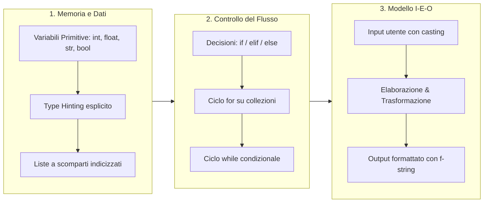

# Mappa Concettuale: Fondamenti e Modelli Mentali

```mermaid
flowchart LR
    subgraph S1 [1. Memoria e Dati]
        direction TB
        V_PRIM[Variabili Primitive: int, float, str, bool] --> TYPE[Type Hinting esplicito]
        TYPE --> LIST_B[Liste a scomparti indicizzati]
    end

    subgraph S2 [2. Controllo del Flusso]
        direction TB
        COND[Decisioni: if / elif / else] --> FOR_L[Ciclo for su collezioni]
        FOR_L --> WHILE_L[Ciclo while condizionale]
    end

    subgraph S3 [3. Modello I-E-O]
        direction TB
        INP[Input utente con casting] --> ELAB[Elaborazione & Trasformazione]
        ELAB --> OUT[Output formattato con f-string]
    end

    S1 --> S2 --> S3
```