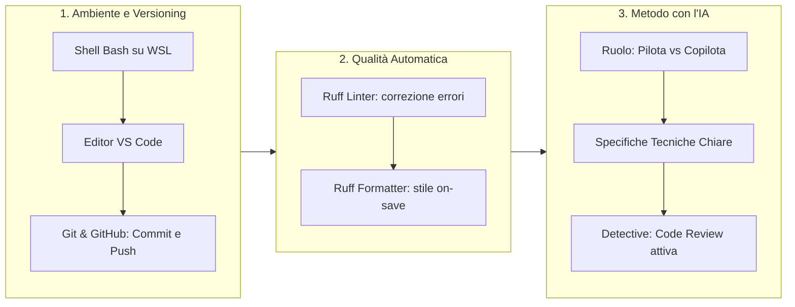

# Mappa Concettuale: Strumenti dello Sviluppatore e Metodo

```mermaid
flowchart LR
    subgraph S1 [1. Ambiente e Versioning]
        direction TB
        BASH[Shell Bash su WSL] --> VSC[Editor VS Code]
        VSC --> GIT[Git & GitHub: Commit e Push]
    end

    subgraph S2 [2. Qualità Automatica]
        direction TB
        RUFF[Ruff Linter: correzione errori] --> STYLE[Ruff Formatter: stile on-save]
    end

    subgraph S3 [3. Metodo con l'IA]
        direction TB
        ROLE[Ruolo: Pilota vs Copilota] --> SPEC[Specifiche Tecniche Chiare]
        SPEC --> DETECT[Detective: Code Review attiva]
    end

    S1 --> S2 --> S3
```