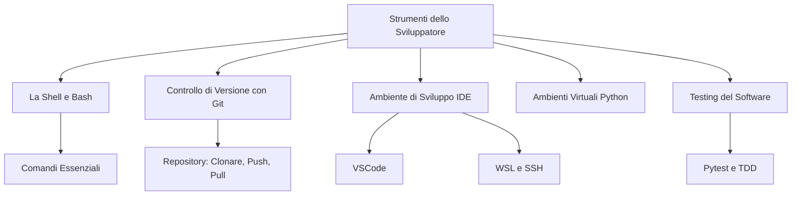

# Mappa Concettuale: Strumenti dello Sviluppatore

Questa mappa riassume i principali strumenti che ogni sviluppatore deve conoscere. Affronteremo ciascuno di questi argomenti nelle prossime lezioni.

