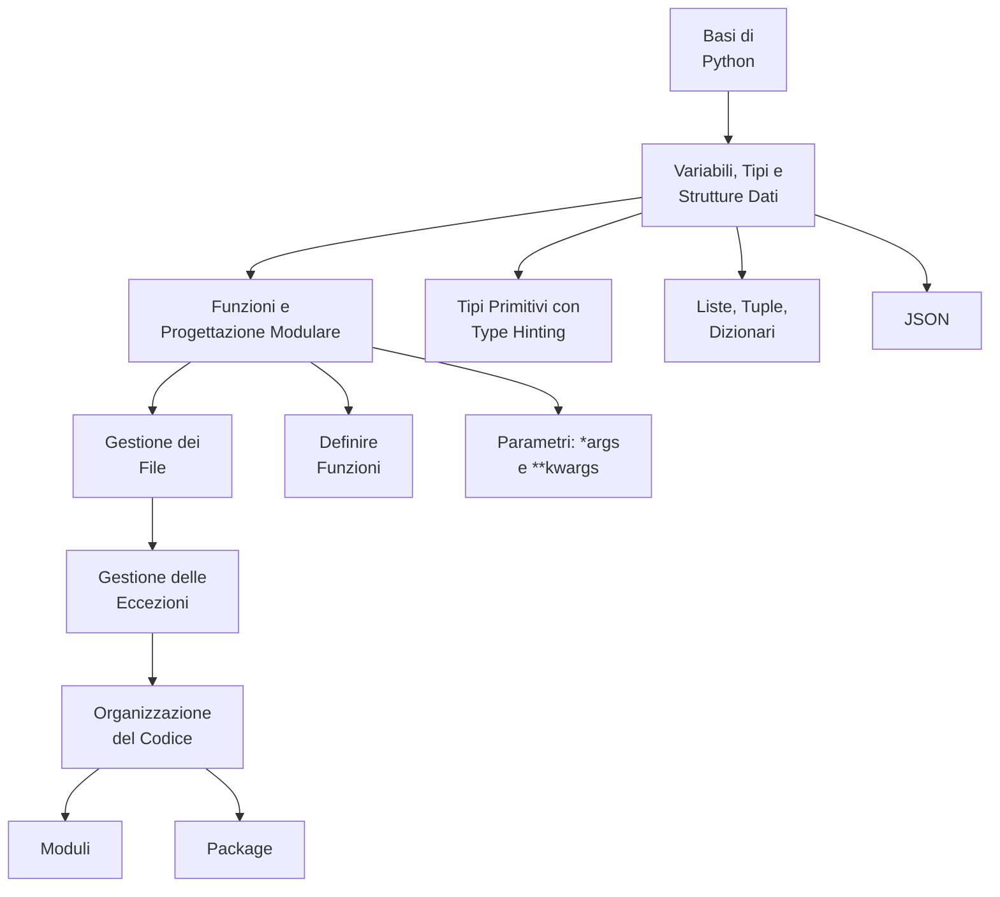

# Mappa Concettuale: Basi della Programmazione Python

Questa mappa delinea il percorso di apprendimento per i fondamenti della programmazione procedurale in Python.

```mermaid
graph TD
    A[Basi di<br>Python] --> B[Variabili, Tipi e<br>Strutture Dati];
    B --> C[Funzioni e<br>Progettazione Modulare];
    C --> D[Gestione dei<br>File];
    D --> E[Gestione delle<br>Eccezioni];
    E --> F[Organizzazione<br>del Codice];

    B --> B1[Tipi Primitivi con<br>Type Hinting];
    B --> B2[Liste, Tuple,<br>Dizionari];
    B --> B3[JSON];
    
    C --> C1[Definire<br>Funzioni];
    C --> C2[Parametri: *args<br>e **kwargs];

    F --> F1[Moduli];
    F --> F2[Package];
```