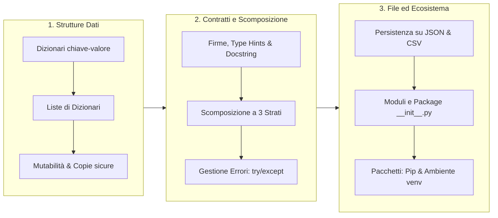

# Mappa Concettuale: Dati, Funzioni, Contratti e Modularità

```mermaid
flowchart LR
    subgraph S1 [1. Strutture Dati]
        direction TB
        DICT[Dizionari chiave-valore] --> LST[Liste di Dizionari]
        LST --> MUT[Mutabilità & Copie sicure]
    end

    subgraph S2 [2. Contratti e Scomposizione]
        direction TB
        SIGN[Firme, Type Hints & Docstring] --> TOPDOWN[Scomposizione a 3 Strati]
        TOPDOWN --> EXC[Gestione Errori: try/except]
    end

    subgraph S3 [3. File ed Ecosistema]
        direction TB
        FILES[Persistenza su JSON & CSV] --> PKG[Moduli e Package __init__.py]
        PKG --> VENV[Pacchetti: Pip & Ambiente venv]
    end

    S1 --> S2 --> S3
```