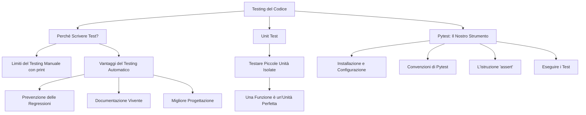

# Mappa Concettuale: Testing e Qualità del Codice

Questa mappa riassume i concetti chiave che affronteremo in questo modulo, introducendo il testing automatico come pratica fondamentale per uno sviluppatore professionista.

