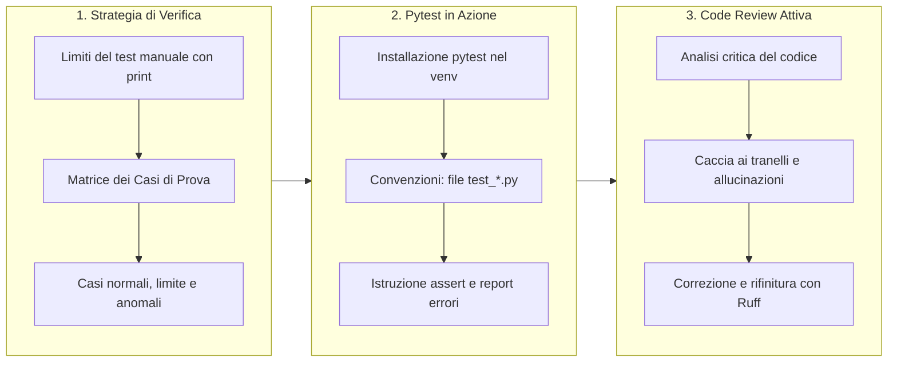

# Mappa Concettuale: Testing, Verifica e Code Review

```mermaid
flowchart LR
    subgraph S1 [1. Strategia di Verifica]
        direction TB
        MAN[Limiti del test manuale con print] --> MATR[Matrice dei Casi di Prova]
        MATR --> EDGES[Casi normali, limite e anomali]
    end

    subgraph S2 [2. Pytest in Azione]
        direction TB
        SETUP[Installazione pytest nel venv] --> CONV[Convenzioni: file test_*.py]
        CONV --> ASSRT[Istruzione assert e report errori]
    end

    subgraph S3 [3. Code Review Attiva]
        direction TB
        AUDIT[Analisi critica del codice] --> TRAPS[Caccia ai tranelli e allucinazioni]
        TRAPS --> REFACTOR[Correzione e rifinitura con Ruff]
    end

    S1 --> S2 --> S3
```