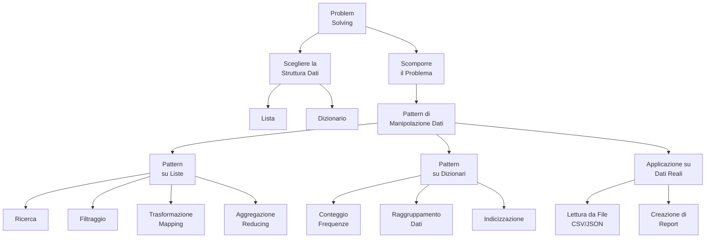

# Mappa Concettuale: Logica di Programmazione e Manipolazione Dati

Questa mappa delinea il percorso che seguiremo per imparare a "pensare da programmatori", trasformando problemi reali in soluzioni software attraverso la manipolazione efficace dei dati.

