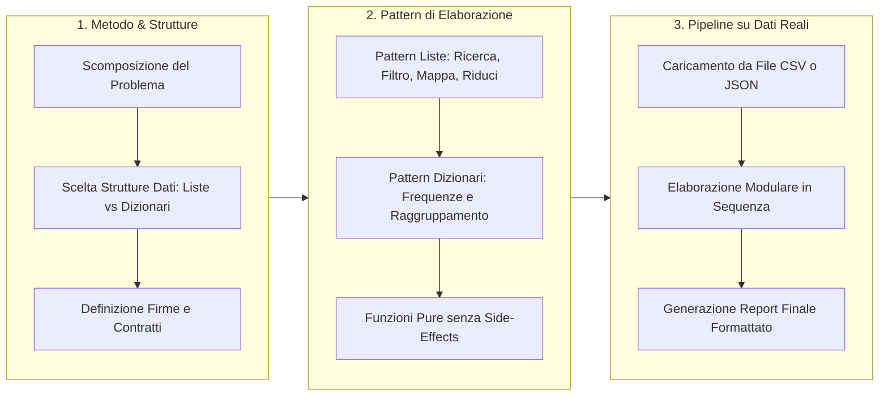

# Mappa Concettuale: Logica e Manipolazione Dati

```mermaid
flowchart LR
    subgraph S1 [1. Metodo & Strutture]
        direction TB
        PROBL[Scomposizione del Problema] --> STRUCT[Scelta Strutture Dati: Liste vs Dizionari]
        STRUCT --> CONTR[Definizione Firme e Contratti]
    end

    subgraph S2 [2. Pattern di Elaborazione]
        direction TB
        LST_PAT[Pattern Liste: Ricerca, Filtro, Mappa, Riduci] --> DICT_PAT[Pattern Dizionari: Frequenze e Raggruppamento]
        DICT_PAT --> PURE_FNC[Funzioni Pure senza Side-Effects]
    end

    subgraph S3 [3. Pipeline su Dati Reali]
        direction TB
        LOAD[Caricamento da File CSV o JSON] --> PIPELINE[Elaborazione Modulare in Sequenza]
        PIPELINE --> REPORT[Generazione Report Finale Formattato]
    end

    S1 --> S2 --> S3
```