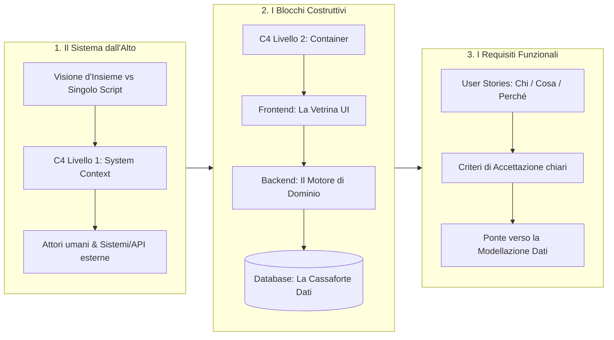

# Mappa Concettuale: Architettura di Sistema e Visione Globale

```mermaid
flowchart LR
    subgraph S1 [1. Il Sistema dall'Alto]
        direction TB
        MACRO[Visione d'Insieme vs Singolo Script] --> C4_L1[C4 Livello 1: System Context]
        C4_L1 --> ACTORS[Attori umani & Sistemi/API esterne]
    end

    subgraph S2 [2. I Blocchi Costruttivi]
        direction TB
        C4_L2[C4 Livello 2: Container] --> FRONT[Frontend: La Vetrina UI]
        FRONT --> BACK[Backend: Il Motore di Dominio]
        BACK --> DB[(Database: La Cassaforte Dati)]
    end

    subgraph S3 [3. I Requisiti Funzionali]
        direction TB
        STORIES[User Stories: Chi / Cosa / Perché] --> ACCEPT[Criteri di Accettazione chiari]
        ACCEPT --> CONTRACTS[Ponte verso la Modellazione Dati]
    end

    S1 --> S2 --> S3
```