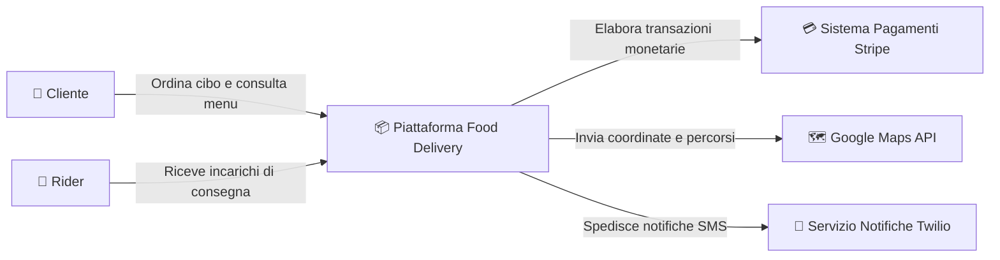
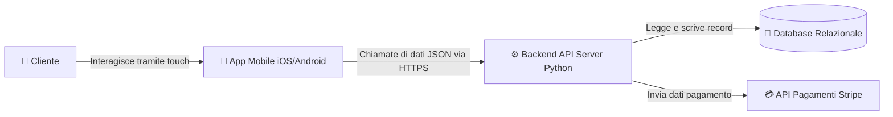

# Visione di Sistema: Il C4 Model (Livello 1 e Livello 2)

In 3ª abbiamo imparato a costruire i singoli "ingranaggi" del codice (funzioni, variabili, cicli). In 4ª facciamo un salto di qualità: **impariamo a progettare l'intera automobile**.

Prima di decidere come scrivere una classe o una funzione, gli ingegneri del software usano uno strumento visivo moderno e potentissimo: il **C4 Model** (ideato da Simon Brown).

Il C4 Model funziona come **Google Maps**: puoi guardare la Terra dallo spazio, zoomare sulla nazione, sulla città o scendere fino alla singola via.

---

## 1. La Metafora dei 4 Blocchi Reali

Tutte le applicazioni moderne che usi ogni giorno sullo smartphone (Deliveroo, Spotify, Instagram, un videogioco online) sono composte da 4 blocchi fondamentali:

```
┌─────────────────────────────────────────────────────────────────────────────┐
│ 1. IL FRONTEND (La Vetrina / Lo Schermo)                                    │
│    L'app mobile o il sito web che l'utente tocca con le dita.               │
│    Serve solo a mostrare informazioni e raccogliere comandi grafici.        │
├─────────────────────────────────────────────────────────────────────────────┤
│ 2. IL BACKEND (Il Cervello / La Cucina)                                     │
│    Il server (il nostro programma Python) che calcola le regole del gioco,  │
│    applica sconti, controlla le autorizzazioni e coordina le operazioni.    │
├─────────────────────────────────────────────────────────────────────────────┤
│ 3. IL DATABASE (La Cassaforte / Il Magazzino)                               │
│    La memoria a lungo termine che non si cancella mai: salva gli utenti,    │
│    lo storico ordini, i punteggi e i profili.                               │
├─────────────────────────────────────────────────────────────────────────────┤
│ 4. LE API ESTERNE (I Fornitori Partner)                                     │
│    Servizi esterni specializzati (es. Google Maps per la geolocalizzazione, │
│    Stripe per i pagamenti, OpenAI per l'assistente intelligente).           │
└─────────────────────────────────────────────────────────────────────────────┘
```

---

## 2. C4 Livello 1: System Context (La Vista dallo Spazio)

Il **System Context** mostra la nostra applicazione come una "scatola nera" al centro e risponde a due sole domande:
1. **Chi sono gli utenti umani che la usano?**
2. **Con quali sistemi o servizi esterni comunica?**

### Esempio: Il Sistema di Consegne a Domicilio (*Deliveroo*)



*Nota:* A questo livello non ci interessa se il codice è scritto in Python o Java, né che tipo di database useremo. Conta solo capire **chi interagisce con il sistema**.

---

## 3. C4 Livello 2: Container (Apriamo la Scatola)

Facciamo uno zoom e apriamo la scatola centrale. Un **Container** nel C4 Model non è un container Docker, ma una singola applicazione o archivio dati eseguibile separatamente.



---

## 4. La Mappa del Tuo Percorso di Studi

Capire il C4 Model ti permette di sapere sempre **perché** stai studiando un certo argomento:

* In **3ª** abbiamo costruito gli algoritmi di base.
* In **4ª** ci concentriamo sulla progettazione del **Backend & Modello di Dominio** (le entità, le regole del business e la loro struttura dati).
* In **5ª** collegheremo il **Frontend Web** e il **Database Relazionale** sul Cloud.