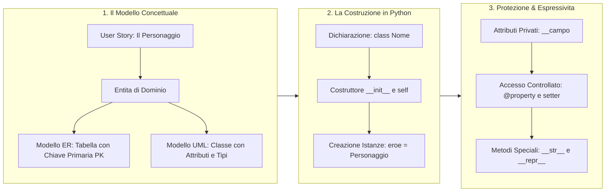

# Mappa Concettuale: La Prima Entità (Dal Dominio alla Classe)

```mermaid
flowchart LR
    subgraph S1 [1. Il Modello Concettuale]
        direction TB
        STORY[User Story: Il Personaggio] --> ENTITY[Entita di Dominio]
        ENTITY --> ER_TAB[Modello ER: Tabella con Chiave Primaria PK]
        ENTITY --> UML_CLS[Modello UML: Classe con Attributi e Tipi]
    end

    subgraph S2 [2. La Costruzione in Python]
        direction TB
        CLS_DEF[Dichiarazione: class Nome] --> INIT[Costruttore __init__ e self]
        INIT --> INSTANCE[Creazione Istanze: eroe = Personaggio]
    end

    subgraph S3 [3. Protezione & Espressivita]
        direction TB
        PRIV[Attributi Privati: __campo] --> PROP[Accesso Controllato: @property e setter]
        PROP --> DUNDER[Metodi Speciali: __str__ e __repr__]
    end

    S1 --> S2 --> S3
```