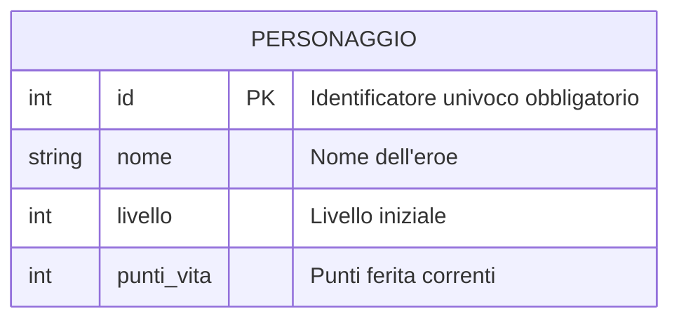
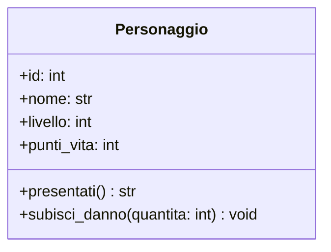

# Dall'Entità alla Classe: La Meccanica di Base (`__init__` e `self`)

In 3ª abbiamo descritto i dati con i **dizionari**:
```python
# Modo procedurale (3ª superiore):
p1 = {"nome": "Aragorn", "livello": 1, "punti_vita": 100}
p2 = {"name": "Legolas", "pv": 85}  # Errori di battitura facili, nessun controllo
```

Questo approccio separa i dati dalle funzioni che li manipolano.
Nella **Programmazione a Oggetti (OOP)** uniamo **dati (attributi)** e **azioni (metodi)** in una singola struttura: la **Classe**.

---

## 1. I 4 Concetti Cardine

```
┌─────────────────────────────────────────────────────────────────────────────┐
│ 1. LA CLASSE (Lo Stampo / Il Progetto)                                      │
│    È la definizione teorica: stabilisce quali dati e quali azioni           │
│    avranno tutti gli elementi di quel tipo (es. "Personaggio").              │
├─────────────────────────────────────────────────────────────────────────────┤
│ 2. L'OGGETTO o ISTANZA (La Cosa Concreta in RAM)                            │
│    È l'individuo reale costruito a partire dallo stampo.                    │
│    Occupa spazio nella memoria RAM ed esiste con i suoi valori specifici.   │
├─────────────────────────────────────────────────────────────────────────────┤
│ 3. GLI ATTRIBUTI (Le Variabili Interne)                                     │
│    I dati memorizzati dentro l'oggetto (es. id, nome, punti_vita).          │
├─────────────────────────────────────────────────────────────────────────────┤
│ 4. I METODI (Le Azioni)                                                     │
│    Le funzioni interne all'oggetto che operano sui suoi attributi.          │
└─────────────────────────────────────────────────────────────────────────────┘
```

---

## 2. Il Modello ER: La Tabella su Disco e la Chiave Primaria (PK)

Quando i dati devono essere salvati stabilmente nel database, l'entità `Personaggio` diventa una **Tabella**.

```
Tabella: PERSONAGGIO
┌───────────┬──────────────┬─────────────┬──────────────┐
│  id (PK)  │     nome     │   livello   │  punti_vita  │  <── COLONNE (Campi)
├───────────┼──────────────┼─────────────┼──────────────┤
│     1     │   Aragorn    │      1      │     100      │  <── RIGA / RECORD 1
│     2     │   Legolas    │      1      │      85      │  <── RIGA / RECORD 2
│     3     │   Aragorn    │      4      │      90      │  <── RIGA / RECORD 3 (Omonimo!)
└───────────┴──────────────┴─────────────┴──────────────┘
```

### Che cos'è la Chiave Primaria (Primary Key - PK)?
Guarda la tabella qui sopra: ci sono due personaggi che si chiamano entrambi *"Aragorn"*. Come fa il computer a distinguerli senza fare confusione?

Non può farlo usando il nome. Deve usare una **Chiave Primaria (PK)**.

La **Chiave Primaria** è una colonna speciale (spesso un numero intero progressivo `id`, oppure un codice come la Matricola scolastica o il Codice Fiscale) che ha un solo compito: **identificare in modo univoco e certo ogni singola riga della tabella**.

### Le 2 Regole Inviolabili della Chiave Primaria:
1. **Unicità Assoluta:** Non possono MAI esistere due righe con lo stesso valore di PK.
2. **Non-Nullità (`NOT NULL`):** Una riga non può MAI avere la chiave primaria vuota o nulla.

Disegniamo lo schema con **Mermaid ER**:



---

## 3. Il Modello UML: La Classe nella Memoria RAM

Nel codice del nostro programma, l'entità diventa una **Classe UML**. 
Anche qui l'attributo `id` è il primo elemento fondamentale della struttura:



---

## 4. Come Nasce un Oggetto: Il Costruttore `__init__`

Quando creiamo un nuovo oggetto, Python alloca una scatola in memoria RAM ed esegue automaticamente la funzione speciale **`__init__`** (*initialize*) per assegnare i valori iniziali alle variabili interne.

```python
class Personaggio:
    # Questa funzione viene eseguita AUTOMATICAMENTE alla nascita di ogni oggetto
    def __init__(self, id_personaggio: int, nome: str, livello: int = 1):
        # Assegniamo le variabili dentro la scatola dell'oggetto:
        self.id: int = id_personaggio
        self.nome: str = nome
        self.livello: int = livello
        self.punti_vita: int = 100  # Valore iniziale di default
```

---

## 5. La Spiegazione di `self`: Il Segnaposto dell'Oggetto

Guarda il primo parametro di ogni metodo: **`self`**.

La classe è scritta una sola volta, ma verrà usata per creare molti oggetti diversi (`eroe1`, `eroe2`, `eroe3`).

Quando chiami un'azione su un oggetto:
```python
eroe1.subisci_danno(30)
```
Python traduce quella riga esattamente in:
```python
# Chiama il metodo della classe passando eroe1 come primo parametro!
Personaggio.subisci_danno(eroe1, 30)
```

* **`self` è semplicemente il segnaposto che riceve l'oggetto specifico che ha chiamato il metodo.**
* Dentro `__init__`, `self.nome = nome` significa: *"Prendi il valore `nome` passato dall'esterno e salvalo come attributo dentro questo specifico oggetto (`self`)."*

---

## 6. Aggiungere Comportamenti: I Metodi

Un **metodo** è una funzione definita dentro la classe. Riceve sempre `self` come primo parametro per poter leggere e modificare le variabili interne dell'oggetto.

```python
class Personaggio:
    def __init__(self, id_personaggio: int, nome: str, livello: int = 1):
        self.id: int = id_personaggio
        self.nome: str = nome
        self.livello: int = livello
        self.punti_vita: int = 100

    # Metodo che legge lo stato
    def presentati(self) -> str:
        return f"Sono {self.nome}, eroe di livello {self.livello} con {self.punti_vita} PV."

    # Metodo che modifica lo stato
    def subisci_danno(self, danno: int) -> None:
        if danno > 0:
            self.punti_vita -= danno
            if self.punti_vita < 0:
                self.punti_vita = 0

    # Metodo speciale per la stampa leggibile con print()
    def __str__(self) -> str:
        return f"Personaggio #{self.id}: {self.nome} (PV: {self.punti_vita}/100)"
```

### Utilizzo Pratico:
```python
# Creiamo due istanze indipendenti
eroe1 = Personaggio(1, "Aragorn", livello=5)
eroe2 = Personaggio(2, "Legolas", livello=4)

print(eroe1)  # Stampa grazie a __str__: Personaggio #1: Aragorn (PV: 100/100)

eroe1.subisci_danno(35)
print(f"PV residui eroe 1: {eroe1.punti_vita}")  # 65
print(f"PV eroe 2 (non toccato): {eroe2.punti_vita}")  # 100
```

---

## 7. Collaudo con Pytest

```python
# tests/test_personaggio.py
from src.personaggio import Personaggio


def test_creazione_personaggio():
    eroe = Personaggio(1, "Gimli")
    assert eroe.id == 1
    assert eroe.nome == "Gimli"
    assert eroe.livello == 1
    assert eroe.punti_vita == 100


def test_subisci_danno_corretto():
    eroe = Personaggio(1, "Gimli")
    eroe.subisci_danno(40)
    assert eroe.punti_vita == 60


def test_danno_mortale_blocca_a_zero():
    eroe = Personaggio(1, "Boromir")
    eroe.subisci_danno(200)
    assert eroe.punti_vita == 0
```