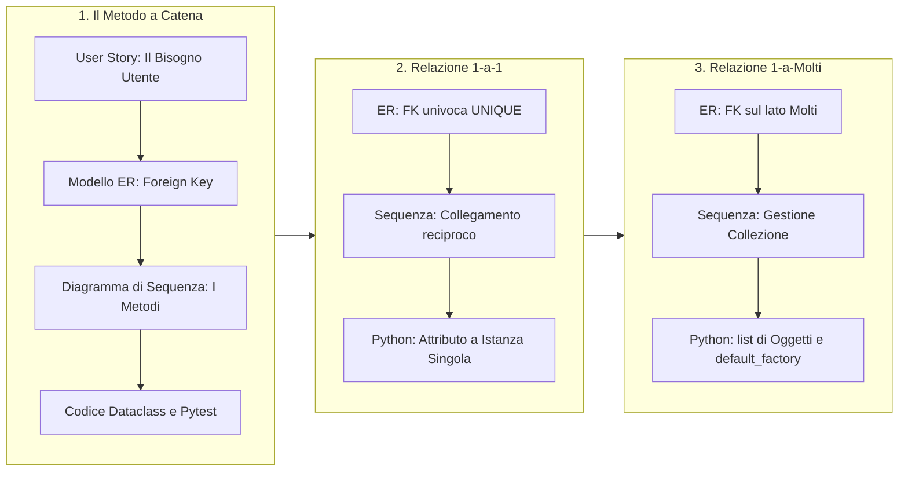

# Mappa Concettuale: Due Entità, Relazioni e Sequenza

```mermaid
flowchart LR
    subgraph S1 [1. Il Metodo a Catena]
        direction TB
        STORY[User Story: Il Bisogno Utente] --> ER_FK[Modello ER: Foreign Key]
        ER_FK --> SEQ[Diagramma di Sequenza: I Metodi]
        SEQ --> CODE[Codice Dataclass e Pytest]
    end

    subgraph S2 [2. Relazione 1-a-1]
        direction TB
        R1_ER[ER: FK univoca UNIQUE] --> R1_SEQ[Sequenza: Collegamento reciproco]
        R1_SEQ --> R1_PY[Python: Attributo a Istanza Singola]
    end

    subgraph S3 [3. Relazione 1-a-Molti]
        direction TB
        RN_ER[ER: FK sul lato Molti] --> RN_SEQ[Sequenza: Gestione Collezione]
        RN_SEQ --> RN_PY[Python: list di Oggetti e default_factory]
    end

    S1 --> S2 --> S3
```