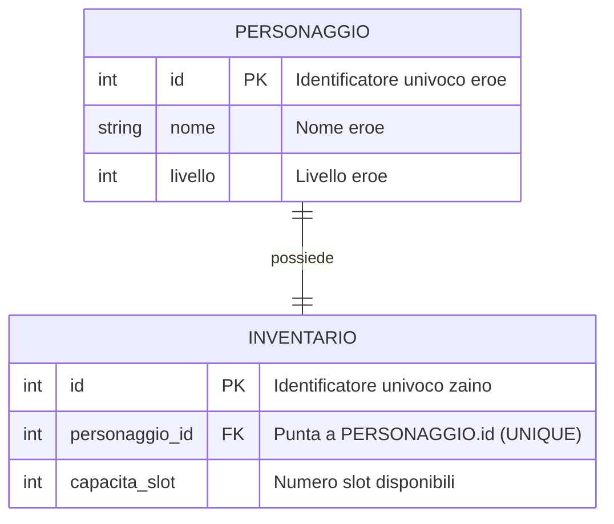
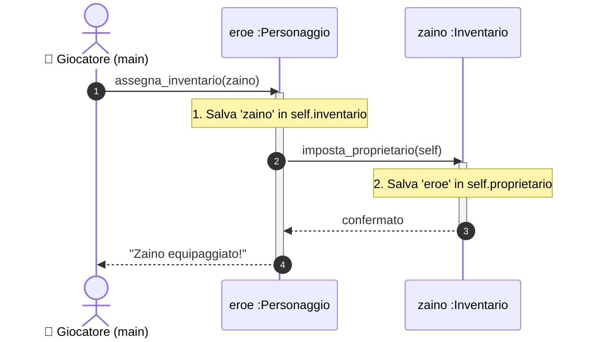
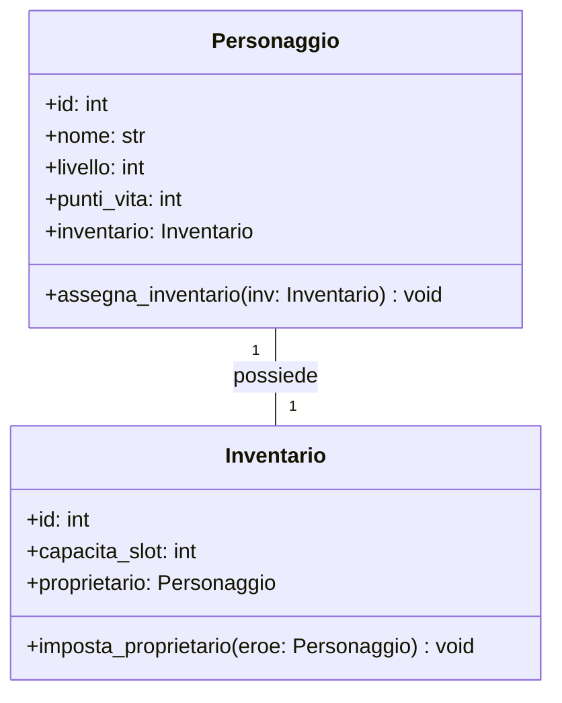

# L'Associazione 1-a-1: Dall'ER alla Sequenza al Codice Python

Nel Modulo 01 abbiamo modellato una singola entità isolata (`Personaggio`).
Ora introduciamo una seconda entità nel nostro gioco: l'**`Inventario`** (lo zaino dell'eroe).

> **User Story:**
> *"Come Giocatore, voglio assegnare uno specifico Zaino al mio Personaggio, in modo che l'Eroe abbia uno spazio dedicato per l'inventario e lo Zaino riconosca il suo legittimo proprietario."*

Questa è una relazione **Uno-a-Uno (1:1)**:
* Un `Personaggio` possiede **un solo** `Inventario`.
* Un `Inventario` appartiene a **un solo** `Personaggio`.

Applichiamo la nostra catena di progettazione completa in 5 passi.

---

## Passo 1: Il Modello ER e la Foreign Key (Chiave Esterna)

Nel database abbiamo due tabelle fisicamente separate: la tabella `PERSONAGGIO` e la tabella `INVENTARIO`.

Come fa il database a sapere che lo zaino #101 appartiene proprio all'eroe "Aragorn" (che ha `id = 1`)?

### Che cos'è una Foreign Key (FK)?
Per creare un legame tra due tabelle, inseriamo in una di esse una colonna speciale chiamata **Foreign Key (Chiave Esterna - FK)**.

Si chiama "Esterna" perché memorizza un valore che non appartiene a quella tabella, ma fa riferimento alla **Primary Key di una tabella esterna**.

```
Tabella: PERSONAGGIO (Tabella di Origine)
┌───────────┬──────────────┬─────────────┐
│  id (PK)  │     nome     │   livello   │
├───────────┼──────────────┼─────────────┤
│     1     │   Aragorn    │      1      │ ◄──────────────┐
│     2     │   Legolas    │      1      │                │ Il valore '1' nella colonna
└───────────┴──────────────┴─────────────┘                │ personaggio_id punta alla
                                                          │ riga con id=1 di PERSONAGGIO
Tabella: INVENTARIO (Tabella Collegata)                   │
┌───────────┬──────────────────────┬──────────────┤       │
│  id (PK)  │  personaggio_id (FK) │  capacita    │       │
├───────────┼──────────────────────┼──────────────┤       │
│    101    │          1           │      20      │ ──────┘
│    102    │          2           │      15      │
└───────────┴──────────────────────┴──────────────┘
```

### Le 2 Regole della Foreign Key:

1. **Integrità Referenziale (Nessun dato orfano):**
   Il database impedisce errori assurdi: non puoi creare uno zaino con `personaggio_id = 999` se non esiste nessun personaggio con `id = 999`. Se provi a farlo, il database blocca l'operazione con un errore di integrità.

2. **Il Vincolo `UNIQUE` nella Relazione 1:1:**
   In una relazione Uno-a-Uno, un eroe non può possedere due zaini contemporaneamente. Per garantire questa regola, alla colonna `personaggio_id` aggiungiamo il vincolo **`UNIQUE`** (valore univoco). Se qualcuno prova a inserire un secondo zaino con lo stesso `personaggio_id = 1`, il database lo rifiuta.

---

### Il Diagramma ER Mermaid

Disegniamo lo schema relazionale con il formato grafico ER:



*Sintassi Mermaid:* `||--||` indica una relazione *esattamente uno a esattamente uno*.

---

## Passo 2: Il Diagramma di Sequenza (La Nascita dei Metodi)

Nel database il legame è un numero (`personaggio_id = 1`). 
Ma nella memoria RAM del computer, come fanno i due oggetti vivi a collegarsi e a parlarsi nel tempo?

Disegniamo il **Diagramma di Sequenza** per realizzare la nostra User Story:



### 🔑 Applicazione della Regola Aurea:
* La freccia 1 punta verso `Personaggio` $\longrightarrow$ Nasce il metodo:
  ```python
  def assegna_inventario(self, inv: Inventario) -> None:
  ```
* La freccia 3 punta verso `Inventario` $\longrightarrow$ Nasce il metodo:
  ```python
  def imposta_proprietario(self, eroe: Personaggio) -> None:
  ```

---

## Passo 3: Il Diagramma delle Classi UML Risultante

Ora completiamo il nostro Diagramma delle Classi UML con attributi e metodi:



---

## Passo 4: Implementazione in Python con `@dataclass`

Nel codice Python, la relazione 1:1 si traduce nel fatto che **un attributo della classe contiene direttamente l'istanza dell'altro oggetto**:

```python
from dataclasses import dataclass


@dataclass
class Inventario:
    id: int
    capacita_slot: int = 20
    # Inizialmente lo zaino non ha proprietario (None)
    proprietario: "Personaggio | None" = None

    def imposta_proprietario(self, eroe: "Personaggio") -> None:
        """Salva il riferimento all'eroe proprietario."""
        self.proprietario = eroe


@dataclass
class Personaggio:
    id: int
    nome: str
    livello: int = 1
    punti_vita: int = 100
    # Inizialmente l'eroe non ha zaino (None)
    inventario: Inventario | None = None

    def assegna_inventario(self, inv: Inventario) -> None:
        """Collega l'inventario all'eroe e imposta il proprietario reciprocamente."""
        self.inventario = inv
        inv.imposta_proprietario(self)
```

### Utilizzo Pratico:
```python
eroe = Personaggio(id=1, nome="Aragorn")
zaino = Inventario(id=101, capacita_slot=30)

# Colleghiamo i due oggetti tramite il metodo
eroe.assegna_inventario(zaino)

# Ora possiamo navigare il legame con la dot notation:
print(f"L'eroe {eroe.nome} ha uno zaino da {eroe.inventario.capacita_slot} slot.")
print(f"Lo zaino #{zaino.id} appartiene a: {zaino.proprietario.nome}")
```

---

## Passo 5: Collaudo con Pytest

```python
# tests/test_associazione_1_1.py
from src.entita import Personaggio, Inventario


def test_collegamento_reciproco_eroe_inventario():
    eroe = Personaggio(id=1, nome="Aragorn")
    zaino = Inventario(id=101, capacita_slot=30)

    # Prima del collegamento sono scollegati
    assert eroe.inventario is None
    assert zaino.proprietario is None

    # Eseguiamo il collegamento
    eroe.assegna_inventario(zaino)

    # Verifichiamo che entrambi conoscano l'altro
    assert eroe.inventario == zaino
    assert eroe.inventario.capacita_slot == 30
    assert zaino.proprietario == eroe
    assert zaino.proprietario.nome == "Aragorn"
```

---

## 🎯 Quadro di Sintesi:
1. **Nel Database (ER):** Il legame 1:1 si fa con una **Foreign Key (FK)** con vincolo `UNIQUE` nella tabella collegata.
2. **Nella Sequenza:** Mostra come gli oggetti si scambiano i riferimenti e genera i metodi.
3. **In Python (RAM):** Il legame 1:1 è un attributo che contiene l'altra istanza (`self.inventario = zaino`).