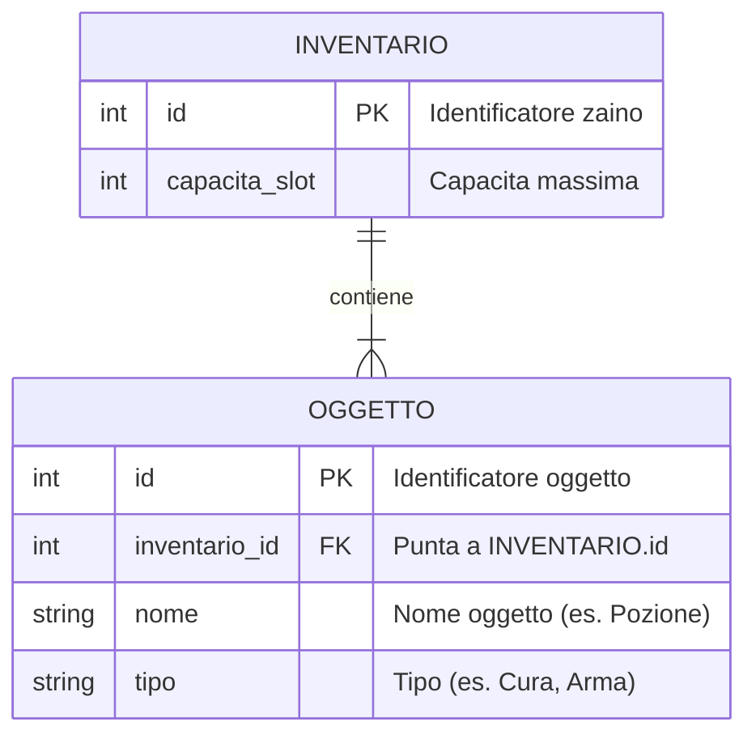
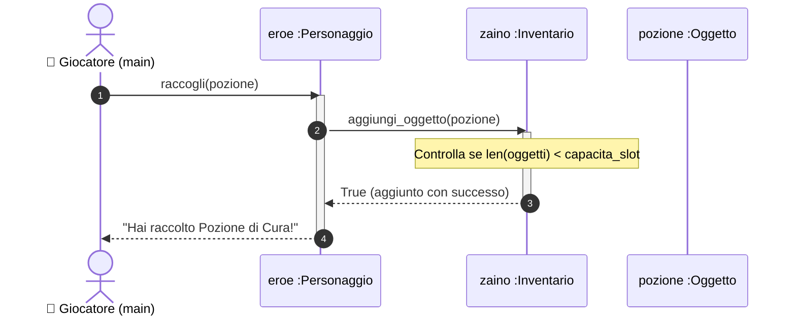
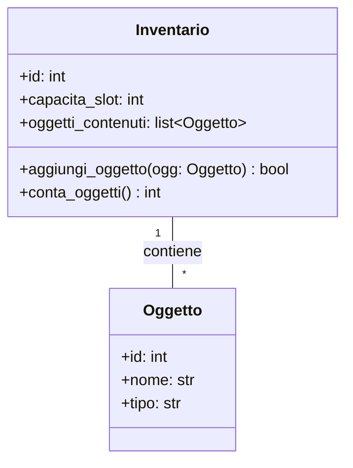

# L'Associazione 1-a-Molti: Collezioni di Oggetti e Sequenza

Ora facciamo un passo ulteriore: all'interno dell'`Inventario` vogliamo poter inserire **molti `Oggetti`** (pozioni, spade, scudi).

> **User Story:**
> *"Come Giocatore, voglio raccogliere un Oggetto trovato nel mondo e metterlo nell'Inventario del mio Eroe, verificando che ci sia spazio disponibile."*

Questa è una relazione **Uno-a-Molti (1:N)**:
* Un `Inventario` contiene **molti** `Oggetti`.
* Ogni `Oggetto` si trova in **un solo** `Inventario` alla volta.

---

## Passo 1: Il Modello ER (La Regola della Foreign Key)

Nel database, come colleghiamo `INVENTARIO` e `OGGETTO`?

> **📌 Regola d'Oro dei Database Relazionali:**
> **La Foreign Key va SEMPRE nella tabella sul lato "Molti".**

L'entità `OGGETTO` (il lato molti) conterrà la colonna `inventario_id (FK)` che punta all'inventario in cui si trova.



---

## Passo 2: Il Diagramma di Sequenza (Raccogliere un Oggetto)

Modelliamo l'azione in cui il giocatore fa raccogliere una pozione all'eroe:



### 🔑 I Metodi Ricavati:
1. `Personaggio` riceve `raccogli(ogg: Oggetto) -> bool`
2. `Inventario` riceve `aggiungi_oggetto(ogg: Oggetto) -> bool`

---

## Passo 3: Il Modello UML delle Classi

In UML, il lato "Uno" (`Inventario`) gestisce una **collezione/lista** di oggetti (`list~Oggetto~`):



---

## Passo 4: Implementazione in Python (`field(default_factory=list)`)

Nel codice Python, per inizializzare una lista vuota indipendente per ogni zaino in una `@dataclass`, dobbiamo usare **`field(default_factory=list)`**:

```python
from dataclasses import dataclass, field


@dataclass
class Oggetto:
    id: int
    nome: str
    tipo: str  # es. "Consumabile", "Arma", "Armatura"


@dataclass
class Inventario:
    id: int
    capacita_slot: int = 20
    # default_factory=list crea una NUOVA lista vuota per ogni istanza di Inventario
    oggetti_contenuti: list[Oggetto] = field(default_factory=list)

    def aggiungi_oggetto(self, ogg: Oggetto) -> bool:
        """Aggiunge l'oggetto solo se c'è spazio disponibile."""
        if len(self.oggetti_contenuti) >= self.capacita_slot:
            print("⚠️ Inventario pieno! Impossibile raccogliere l'oggetto.")
            return False

        self.oggetti_contenuti.append(ogg)
        return True

    def conta_oggetti(self) -> int:
        return len(self.oggetti_contenuti)


@dataclass
class Personaggio:
    id: int
    nome: str
    inventario: Inventario | None = None

    def raccogli(self, ogg: Oggetto) -> bool:
        """Delega l'azione al proprio inventario."""
        if self.inventario is None:
            print("Non hai uno zaino in cui mettere l'oggetto!")
            return False
        return self.inventario.aggiungi_oggetto(ogg)
```

---

## Passo 5: Collaudo con Pytest

```python
# tests/test_associazione_1_n.py
from src.entita import Personaggio, Inventario, Oggetto


def test_aggiunta_oggetti_inventario():
    zaino = Inventario(id=1, capacita_slot=2)
    spada = Oggetto(id=10, nome="Spada di Ferro", tipo="Arma")
    pozione = Oggetto(id=20, nome="Pozione di Cura", tipo="Consumabile")
    scudo = Oggetto(id=30, nome="Scudo di Legno", tipo="Armatura")

    # Aggiungiamo i primi due oggetti (spazio sufficiente)
    assert zaino.aggiungi_oggetto(spada) is True
    assert zaino.aggiungi_oggetto(pozione) is True
    assert zaino.conta_oggetti() == 2

    # Proviamo ad aggiungere il terzo (zaino pieno!)
    assert zaino.aggiungi_oggetto(scudo) is False
    assert zaino.conta_oggetti() == 2


def test_eroe_raccoglie_oggetto_nello_zaino():
    eroe = Personaggio(id=1, nome="Aragorn")
    eroe.inventario = Inventario(id=101, capacita_slot=5)

    pozione = Oggetto(id=20, nome="Pozione di Cura", tipo="Consumabile")
    successo = eroe.raccogli(pozione)

    assert successo is True
    assert len(eroe.inventario.oggetti_contenuti) == 1
    assert eroe.inventario.oggetti_contenuti[0].nome == "Pozione di Cura"
```