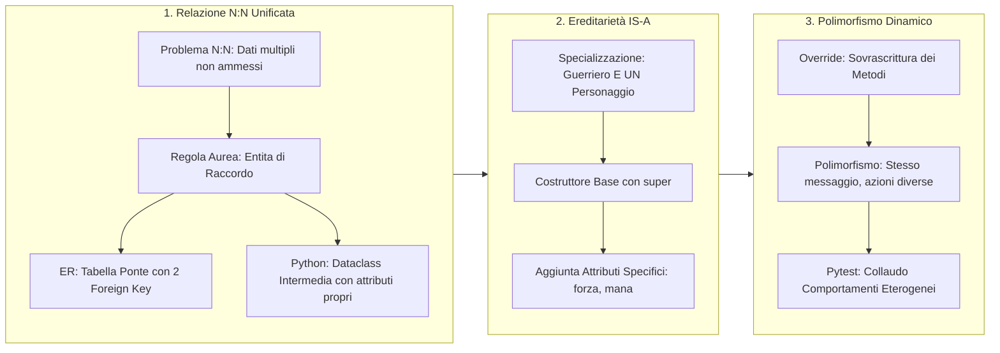

# Mappa Concettuale: Relazioni N:N ed Ereditarietà

```mermaid
flowchart LR
    subgraph S1 [1. Relazione N:N Unificata]
        direction TB
        NN_PROBL[Problema N:N: Dati multipli non ammessi] --> BRIDGE[Regola Aurea: Entita di Raccordo]
        BRIDGE --> ER_FK2[ER: Tabella Ponte con 2 Foreign Key]
        BRIDGE --> PY_BRIDGE[Python: Dataclass Intermedia con attributi propri]
    end

    subgraph S2 [2. Ereditarietà IS-A]
        direction TB
        ISA[Specializzazione: Guerriero E UN Personaggio] --> SUPER[Costruttore Base con super]
        SUPER --> EXTEND[Aggiunta Attributi Specifici: forza, mana]
    end

    subgraph S3 [3. Polimorfismo Dinamico]
        direction TB
        OVERRIDE[Override: Sovrascrittura dei Metodi] --> POLY[Polimorfismo: Stesso messaggio, azioni diverse]
        POLY --> PYTEST_POLY[Pytest: Collaudo Comportamenti Eterogenei]
    end

    S1 --> S2 --> S3
```