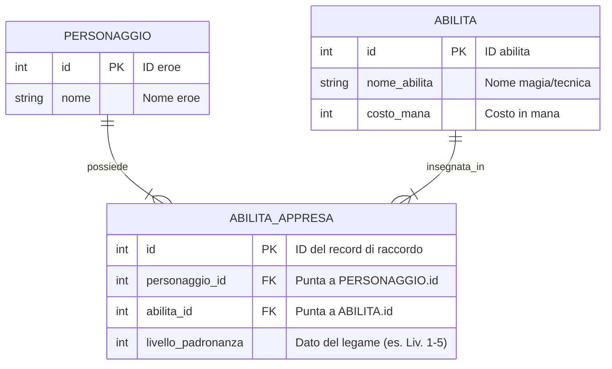
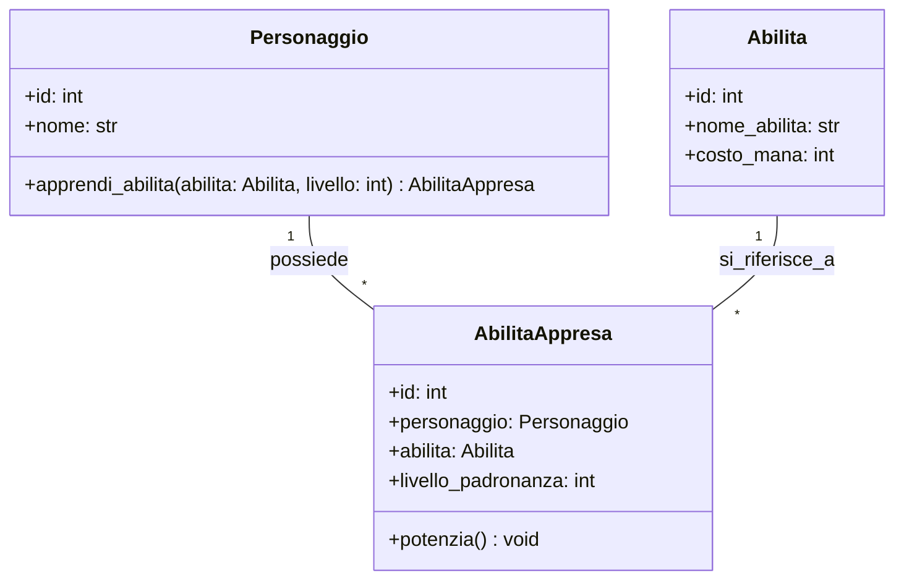

# Le Relazioni Molti-a-Molti (N:N) e l'Entità di Raccordo

Fino ad ora abbiamo visto relazioni semplici: un Personaggio possiede un Inventario (1:1) e un Inventario contiene molti Oggetti (1:N).

Ma cosa succede quando introduciamo le **Abilità** nel nostro gioco?

> **User Story:**
> *"Come Giocatore, voglio che il mio Personaggio possa apprendere diverse Abilità (es. 'Palla di Fuoco', 'Guarigione') e migliorare il livello di padronanza di ciascuna di esse."*

Analizziamo il legame:
* Un `Personaggio` può apprendere **molte** `Abilita`.
* Una stessa `Abilita` può essere appresa da **molti** `Personaggi`.

Questa è una relazione **Molti-a-Molti (N:N)**.

---

## 1. Perché la Relazione N:N "Piatta" Non Funziona

Nei database relazionali (e nella buona ingegneria del software), **non possiamo inserire una lista dentro una cella di una tabella**.

Inoltre, riflettiamo: dove memorizziamo il dato *"a che livello di padronanza (da 1 a 5) l'eroe Aragorn conosce la Palla di Fuoco?"*
* Non possiamo metterlo nella tabella `ABILITA` (perché il livello cambia da eroe a eroe).
* Non possiamo metterlo nella tabella `PERSONAGGIO` (perché l'eroe ha abilità diverse a livelli diversi).

Quel dato appartiene **al legame stesso** tra Aragorn e la Palla di Fuoco.

---

## 2. 🔑 La Regola Aurea: L'Entità di Raccordo (Junction Entity)

> **Ogni relazione Molti-a-Molti si scompone SEMPRE in DUE relazioni 1-a-Molti, introducendo un'Entità di Raccordo.**

Nel nostro caso creiamo l'entità intermedia: **`AbilitaAppresa`** (o *Iscrizione*, *DettaglioOrdine* in altri contesti).

```
Tabella: PERSONAGGIO                   Tabella: ABILITA_APPRESA (Raccordo)             Tabella: ABILITA
┌───────────┬──────────────┐           ┌────────────────┬────────────┬─────────┐       ┌───────────┬─────────────────┐
│  id (PK)  │     nome     │           │ personaggio_id │ abilita_id │ livello │       │  id (PK)  │   nome_abilita  │
├───────────┼──────────────┤           ├────────────────┼────────────┼─────────┤       ├───────────┼─────────────────┤
│     1     │   Aragorn    │ ◄───┐──── │       1 (FK)   │   10 (FK)  │    3    │ ────► │    10     │ Palla di Fuoco  │
│     2     │   Merlino    │ ◄─┐ └──── │       1 (FK)   │   20 (FK)  │    1    │ ────► │    20     │ Guarigione      │
└───────────┴──────────────┘   └────── │       2 (FK)   │   10 (FK)  │    5    │ ────► │    10     │ Palla di Fuoco  │
                                       └────────────────┴────────────┴─────────┘       └───────────┴─────────────────┘
```

---

## 3. Il Modello ER con Tabella di Raccordo

Nel Diagramma ER, l'entità `ABILITA_APPRESA` ha due Foreign Key (`personaggio_id` e `abilita_id`) che formano insieme il legame:



---

## 4. Il Modello UML delle Classi

In UML la classe intermedia `AbilitaAppresa` collega le due classi e contiene i suoi attributi specifici:



---

## 5. Implementazione in Python con Dataclass

```python
from dataclasses import dataclass


@dataclass
class Abilita:
    id: int
    nome_abilita: str
    costo_mana: int


@dataclass
class Personaggio:
    id: int
    nome: str


@dataclass
class AbilitaAppresa:
    """Entità di raccordo: unisce un Personaggio a un'Abilità con un proprio livello."""

    id: int
    personaggio: Personaggio
    abilita: Abilita
    livello_padronanza: int = 1

    def potenzia(self) -> None:
        """Aumenta il livello di maestria dell'abilità per questo specifico eroe."""
        if self.livello_padronanza < 5:
            self.livello_padronanza += 1
```

### Utilizzo:
```python
# 1. Creiamo gli eroi e le abilità
aragorn = Personaggio(1, "Aragorn")
merlino = Personaggio(2, "Merlino")

fuoco = Abilita(10, "Palla di Fuoco", costo_mana=25)
cura = Abilita(20, "Guarigione", costo_mana=15)

# 2. Creiamo i legami N:N tramite l'entità di raccordo
link1 = AbilitaAppresa(id=101, personaggio=aragorn, abilita=fuoco, livello_padronanza=1)
link2 = AbilitaAppresa(id=102, personaggio=merlino, abilita=fuoco, livello_padronanza=4)

# Merlino potenzia la sua maestria
link2.potenzia()

print(f"{aragorn.nome} usa {link1.abilita.nome_abilita} a livello {link1.livello_padronanza}")  # Livello 1
print(f"{merlino.nome} usa {link2.abilita.nome_abilita} a livello {link2.livello_padronanza}")  # Livello 5
```

---

## 6. Collaudo con Pytest

```python
# tests/test_relazione_nn.py
from src.entita import Personaggio, Abilita, AbilitaAppresa


def test_relazione_molti_a_molti():
    eroe = Personaggio(1, "Conan")
    colpo = Abilita(10, "Fendente", 0)

    legame = AbilitaAppresa(id=1, personaggio=eroe, abilita=colpo, livello_padronanza=2)

    assert legame.personaggio.nome == "Conan"
    assert legame.abilita.nome_abilita == "Fendente"
    assert legame.livello_padronanza == 2

    legame.potenzia()
    assert legame.livello_padronanza == 3
```