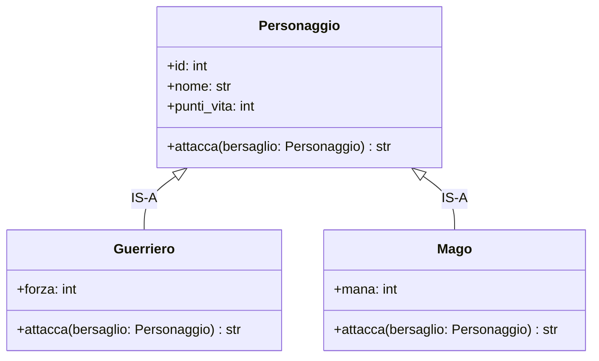

# Ereditarietà Pragmatica (IS-A) e Polimorfismo

Finora abbiamo visto come gli oggetti si collegano tra loro tramite le **Associazioni** (relazione *HAS-A*, "ha un").

Ora vediamo un altro legame fondamentale: la **Specializzazione** (relazione *IS-A*, "è un").

> **User Story:**
> *"Come Giocatore, voglio poter scegliere tra diverse classi specializzate di eroi, come il Guerriero (che usa la forza fisica) e il Mago (che consuma mana per lanciare magie)."*

Un `Guerriero` **è un** `Personaggio`. Un `Mago` **è un** `Personaggio`.

---

## 1. Perché Usare l'Ereditarietà?

Senza ereditarietà dovremmo creare due classi separate ricopiando ogni volta `id`, `nome`, `livello`, `punti_vita` e il metodo `subisci_danno()`.

Con l'**Ereditarietà**:
1. **Riutilizzo del Codice:** La classe genitore (**Superclasse** `Personaggio`) definisce le caratteristiche comuni a tutti gli eroi.
2. **Specializzazione:** Le classi figlie (**Sottoclassi** `Guerriero` e `Mago`) ereditano tutto e aggiungono solo i propri campi e comportamenti specifici.

---

## 2. Il Diagramma UML con la Freccia di Generalizzazione

In UML l'ereditarietà si indica con una **freccia con la punta a triangolo vuoto** che punta verso la classe genitore:



---

## 3. Implementazione in Python: La Funzione `super()`

La sintassi Python per ereditare è indicare la superclasse tra parentesi: `class Guerriero(Personaggio):`.

Per inizializzare correttamente gli attributi comuni usiamo **`super().__init__(...)`**: dice a Python di eseguire prima il costruttore del genitore.

```python
class Personaggio:
    def __init__(self, id_pers: int, nome: str, punti_vita: int = 100):
        self.id: int = id_pers
        self.nome: str = nome
        self.punti_vita: int = punti_vita

    def attacca(self, bersaglio: "Personaggio") -> str:
        """Azione base di attacco."""
        danno = 10
        bersaglio.punti_vita -= danno
        return f"{self.nome} sferra un attacco base su {bersaglio.nome} infliggendo {danno} PV!"


class Guerriero(Personaggio):
    def __init__(self, id_pers: int, nome: str, forza: int, punti_vita: int = 120):
        # Chiama il costruttore del genitore per id, nome e punti_vita
        super().__init__(id_pers, nome, punti_vita)
        self.forza: int = forza  # Attributo specifico del Guerriero


class Mago(Personaggio):
    def __init__(self, id_pers: int, nome: str, mana: int = 50, punti_vita: int = 80):
        super().__init__(id_pers, nome, punti_vita)
        self.mana: int = mana  # Attributo specifico del Mago
```

---

## 4. L'Override dei Metodi e il Polimorfismo

Il vero potere dell'ereditarietà emerge con l'**Override** (sovrascrittura): una classe figlia può ridefinire un metodo del genitore per cambiare il modo in cui compie quell'azione.

* Il `Guerriero` usa la sua `forza` per fare più danno fisico.
* Il `Mago` consuma `mana` per scagliare un dardo magico.

```python
class Guerriero(Personaggio):
    def __init__(self, id_pers: int, nome: str, forza: int, punti_vita: int = 120):
        super().__init__(id_pers, nome, punti_vita)
        self.forza: int = forza

    # OVERRIDE del metodo attacca:
    def attacca(self, bersaglio: Personaggio) -> str:
        danno_totale = 10 + self.forza
        bersaglio.punti_vita -= danno_totale
        return f"⚔️ {self.nome} sferra un colpo potente da {danno_totale} danni su {bersaglio.nome}!"


class Mago(Personaggio):
    def __init__(self, id_pers: int, nome: str, mana: int = 50, punti_vita: int = 80):
        super().__init__(id_pers, nome, punti_vita)
        self.mana: int = mana

    # OVERRIDE del metodo attacca:
    def attacca(self, bersaglio: Personaggio) -> str:
        if self.mana >= 15:
            self.mana -= 15
            danno_magico = 25
            bersaglio.punti_vita -= danno_magico
            return f"✨ {self.nome} lancia un dardo magico da {danno_magico} danni (Mana rimasto: {self.mana})!"
        else:
            return f"💨 {self.nome} non ha abbastanza mana per attaccare!"
```

---

## 5. Il Polimorfismo in Azione

**Polimorfismo** significa letteralmente *"molte forme"*. 

Nel codice significa che possiamo trattare una lista di oggetti eterogenei inviando lo **stesso identico messaggio (`.attacca()`)**, e ciascun oggetto risponderà automaticamente secondo la propria specifica natura:

```python
conan = Guerriero(id_pers=1, nome="Conan", forza=15)
merlino = Mago(id_pers=2, nome="Merlino", mana=50)
nemico = Personaggio(id_pers=99, nome="Orco", punti_vita=100)

squadra: list[Personaggio] = [conan, merlino]

# Il Polimorfismo in un semplice ciclo:
for eroe in squadra:
    # Python sa da solo quale versione del metodo 'attacca' eseguire!
    messaggio = eroe.attacca(nemico)
    print(messaggio)

print(f"PV residui del nemico: {nemico.punti_vita}")
```

### Output:
```text
⚔️ Conan sferra un colpo potente da 25 danni su Orco!
✨ Merlino lancia un dardo magico da 25 danni (Mana rimasto: 35)!
PV residui del nemico: 50
```

---

## 6. Collaudo con Pytest

```python
# tests/test_polimorfismo.py
from src.entita import Personaggio, Guerriero, Mago


def test_attacco_guerriero_calcola_forza():
    guerriero = Guerriero(1, "Conan", forza=10)
    bersaglio = Personaggio(99, "Bersaglio", punti_vita=100)

    guerriero.attacca(bersaglio)
    assert bersaglio.punti_vita == 80  # 100 - (10 base + 10 forza)


def test_attacco_mago_consuma_mana():
    mago = Mago(2, "Merlino", mana=20)
    bersaglio = Personaggio(99, "Bersaglio", punti_vita=100)

    mago.attacca(bersaglio)
    assert mago.mana == 5  # 20 - 15
    assert bersaglio.punti_vita == 75  # 100 - 25
```