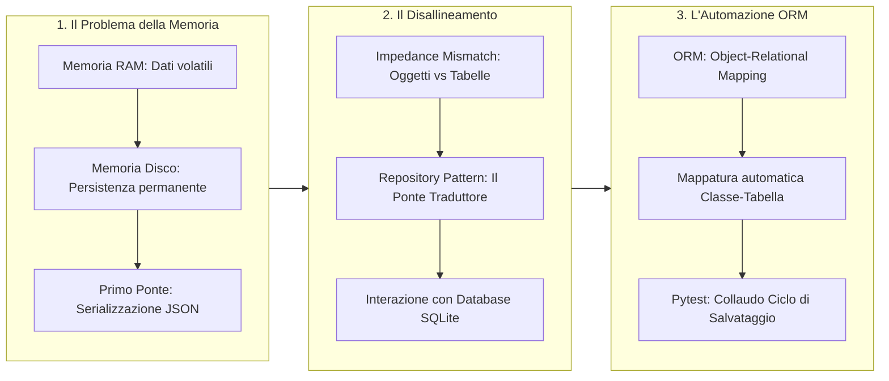

# Mappa Concettuale: Persistenza dei Dati (Repository e ORM)

```mermaid
flowchart LR
    subgraph S1 [1. Il Problema della Memoria]
        direction TB
        VOLATILE[Memoria RAM: Dati volatili] --> DISK[Memoria Disco: Persistenza permanente]
        DISK --> JSON_SAVE[Primo Ponte: Serializzazione JSON]
    end

    subgraph S2 [2. Il Disallineamento]
        direction TB
        MISMATCH[Impedance Mismatch: Oggetti vs Tabelle] --> REPO[Repository Pattern: Il Ponte Traduttore]
        REPO --> SQLITE[Interazione con Database SQLite]
    end

    subgraph S3 [3. L'Automazione ORM]
        direction TB
        ORM_DEF[ORM: Object-Relational Mapping] --> AUTO[Mappatura automatica Classe-Tabella]
        AUTO --> PYTEST_PERS[Pytest: Collaudo Ciclo di Salvataggio]
    end

    S1 --> S2 --> S3
```