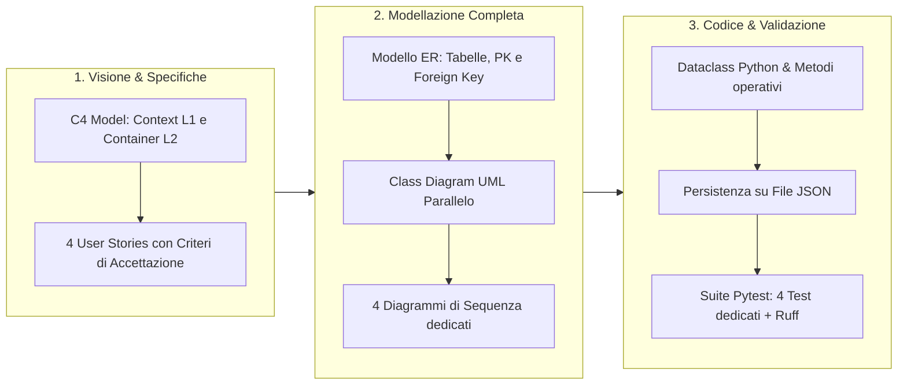

# Mappa Concettuale: La Pipeline Completa del Progetto

```mermaid
flowchart LR
    subgraph S1 [1. Visione & Specifiche]
        direction TB
        C4_ARCH[C4 Model: Context L1 e Container L2] --> STORIES_4[4 User Stories con Criteri di Accettazione]
    end

    subgraph S2 [2. Modellazione Completa]
        direction TB
        ER_ALL[Modello ER: Tabelle, PK e Foreign Key] --> UML_ALL[Class Diagram UML Parallelo]
        UML_ALL --> SEQ_4[4 Diagrammi di Sequenza dedicati]
    end

    subgraph S3 [3. Codice & Validazione]
        direction TB
        PY_MODELS[Dataclass Python & Metodi operativi] --> JSON_STORE[Persistenza su File JSON]
        JSON_STORE --> PYTEST_FULL[Suite Pytest: 4 Test dedicati + Ruff]
    end

    S1 --> S2 --> S3
```