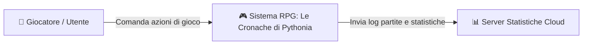
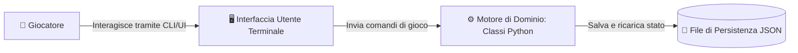

# Progetto Faro - Fase 1: Requisiti di Sistema, C4 Model e User Stories

Partiamo da uno scenario reale: la progettazione del nucleo software per il nostro gioco di ruolo (*RPG - Le Cronache di Pythonia*).

---

## 1. Il Testo dei Requisiti del Committente

> *"Vogliamo realizzare il motore software per un gioco RPG a turni. Il sistema deve consentire di creare eroi base o specializzati (come i Guerrieri, dotati di forza fisica aumentata). Ogni eroe possiede uno zaino/inventario con un numero massimo di slot per contenere oggetti (pozioni curative e armi). Gli eroi possono apprendere abilità speciali e potenziarne la maestria. Infine, il sistema deve permettere di salvare lo stato della partita su file JSON e ricaricarlo per riprendere il gioco."*

---

## 2. C4 Model - Livello 1: System Context (La Vista Aerea)

Mostra l'ecosistema globale: chi usa il sistema e quali sistemi esterni interagiscono con esso.

---

## 3. C4 Model - Livello 2: Container (I Componenti Software)

Mostra i blocchi che compongono il nostro sistema:

---

## 4. Le 4 User Stories Dettagliate con Criteri di Accettazione

Scomponiamo l'intero problema in **4 User Stories formali**:

### 🎯 US-01: Gestione dell'Inventario e Raccolta Oggetti (Relazione 1:1 e 1:N)
* **User Story:** *Come Giocatore, voglio raccogliere oggetti dal mondo e inserirli nello zaino del mio eroe, in modo da poterli usare durante l'avventura.*
* **Criteri di Accettazione:**
  - L'eroe deve possedere un inventario associato.
  - L'inventario ha una capacità massima di slot (`capacita_slot`).
  - Se c'è spazio, l'oggetto viene aggiunto e l'operazione restituisce `True`.
  - Se lo zaino è pieno, l'oggetto viene rifiutato e l'operazione restituisce `False`.

---

### 🎯 US-02: Combattimento e Specializzazione (Relazione IS-A e Polimorfismo)
* **User Story:** *Come Giocatore, voglio che il Guerriero infligga danni aumentati dalla sua statistica `forza`, per sconfiggere i nemici più velocemente.*
* **Criteri di Accettazione:**
  - Il `Guerriero` eredita tutti i campi del `Personaggio` base.
  - Il metodo `attacca(bersaglio)` del Guerriero infligge un danno pari a: `10 (base) + forza`.
  - I punti vita del bersaglio attaccato si riducono del valore del danno.
  - I punti vita del bersaglio non possono mai scendere sotto `0`.

---

### 🎯 US-03: Apprendimento e Potenziamento Abilità (Relazione N:N)
* **User Story:** *Come Giocatore, voglio che il mio eroe apprenda abilità speciali e ne aumenti il livello di maestria per diventare più potente.*
* **Criteri di Accettazione:**
  - Un eroe può apprendere più abilità e un'abilità può essere appresa da più eroi.
  - Il legame tra eroe e abilità memorizza il `livello_maestria` (inizialmente pari a 1).
  - Il metodo `potenzia()` incrementa la maestria di 1 fino a un massimo di 5.

---

### 🎯 US-04: Persistenza e Ricaricamento della Partita
* **User Story:** *Come Giocatore, voglio salvare la partita su file JSON e ricaricarla al riavvio, per non perdere i progressi del mio eroe.*
* **Criteri di Accettazione:**
  - Lo stato completo dell'eroe (compreso zaino e oggetti contenuti) viene salvato su file `.json`.
  - Il file salvato deve poter essere ricaricato ricostruendo gli oggetti Python originali.
  - L'eroe ricaricato deve mantenere intatta la propria classe (`Guerriero` o `Personaggio`), i punti vita e la lista di oggetti nello zaino.