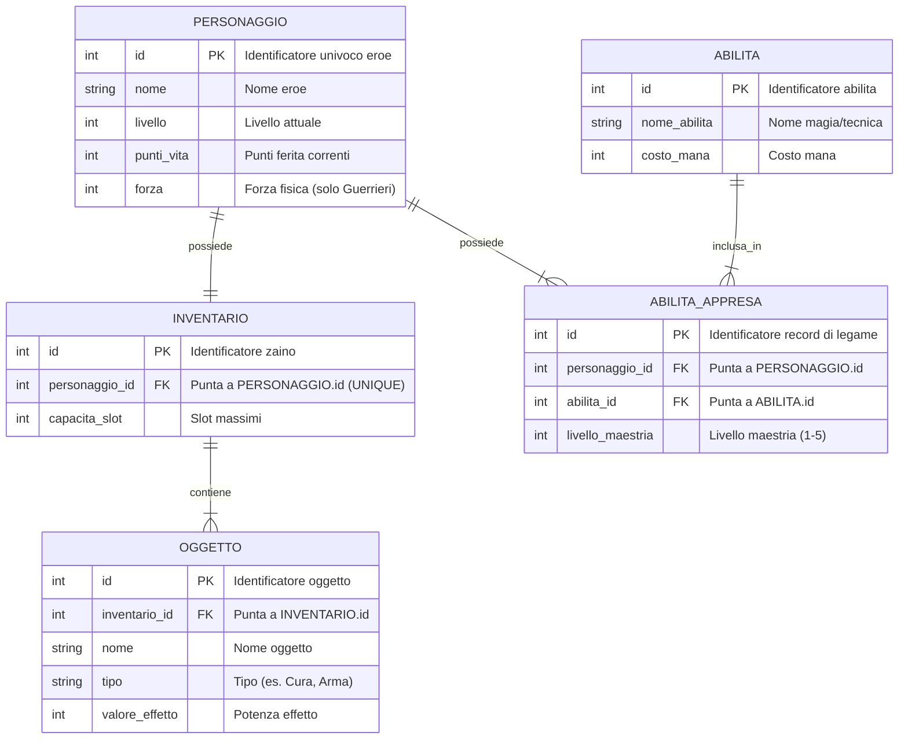
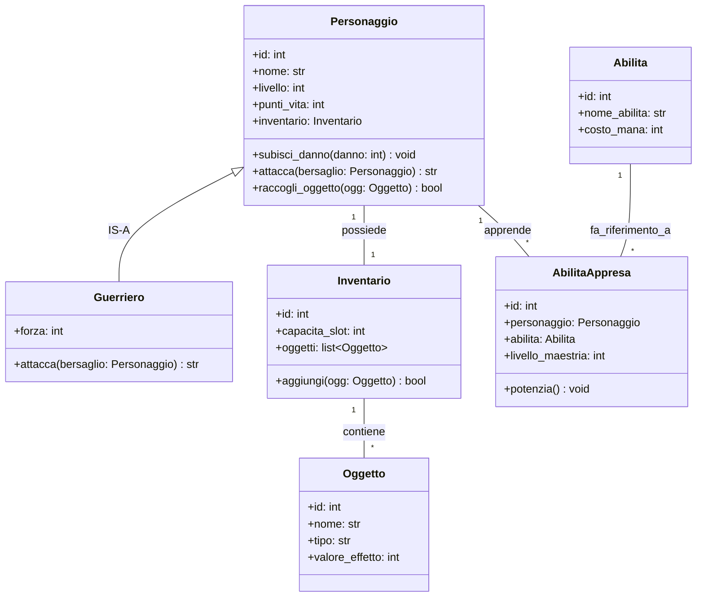

# Progetto Faro - Fase 2: Modellazione dei Dati in Parallelo (ER e UML)

Dalle 4 User Stories emergono le entità del dominio: `Personaggio`, `Guerriero`, `Inventario`, `Oggetto`, `Abilita` e l'entità ponte `AbilitaAppresa`.

Modelliamo la struttura statica nei due linguaggi paralleli.

---

## 1. Il Modello ER Completo (Database su Disco)

Nel database relazionale definiamo le tabelle con le **Primary Key (PK)** e le **Foreign Key (FK)** posizionate secondo le nostre regole univoche:
* Relazione 1:1 $\longrightarrow$ `personaggio_id FK` nella tabella `INVENTARIO` con vincolo `UNIQUE`.
* Relazione 1:N $\longrightarrow$ `inventario_id FK` nella tabella `OGGETTO` (sul lato molti).
* Relazione N:N $\longrightarrow$ Scomposta nella tabella ponte `ABILITA_APPRESA` con due Foreign Key.

---

## 2. Il Diagramma delle Classi UML Completo (Oggetti in RAM)

Nel programma Python, le entità prendono forma come classi con attributi tipizzati e relazioni strutturate:

