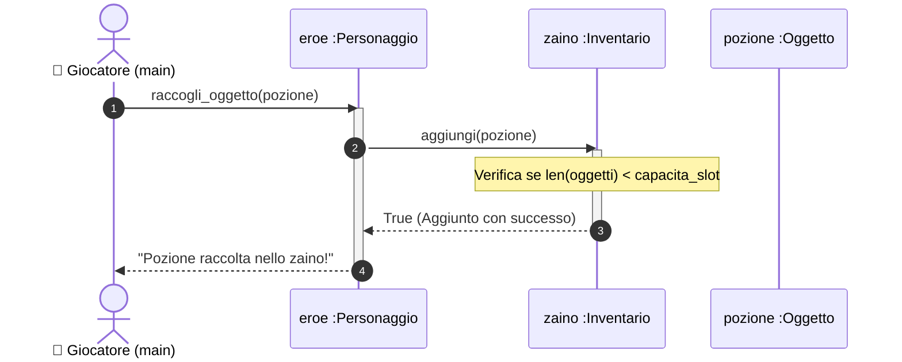
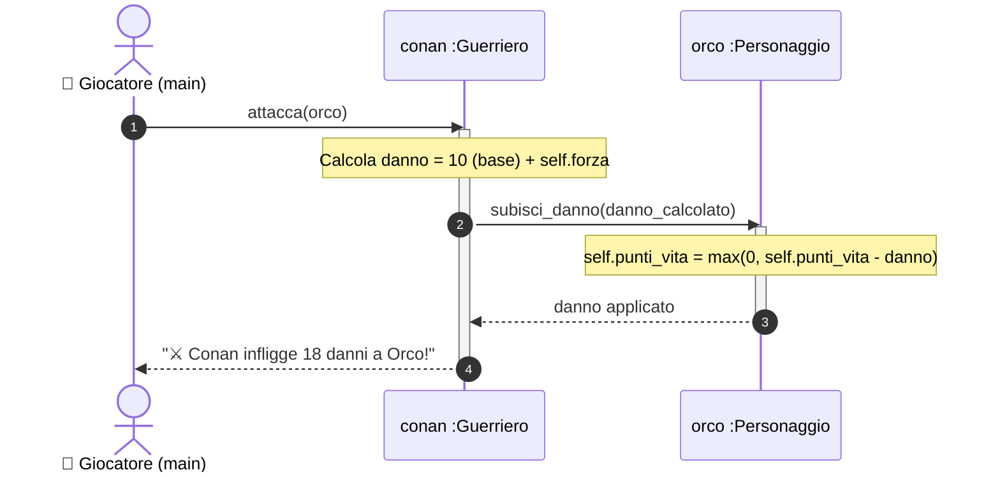
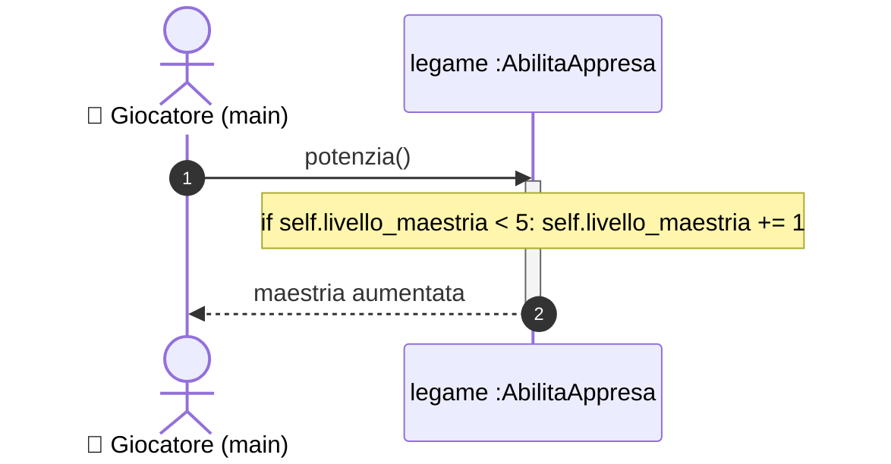
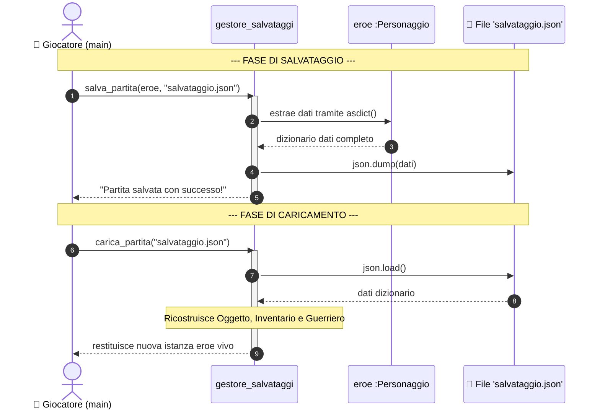

# Progetto Faro - Fase 3: Modellazione Dinamica (Tutte le Sequenze)

Per garantire la massima chiarezza e non lasciare nulla al caso, disegniamo il **Diagramma di Sequenza per ciascuna delle nostre 4 User Stories**.

Ricordiamo la **Regola Aurea**: ogni freccia che arriva a un oggetto definisce il metodo da scrivere nella classe corrispondente.

---

## 🎬 Sequenza 1: Raccolta Oggetto nell'Inventario (US-01)

Mostra l'interazione tra l'Eroe e il suo Zaino per raccogliere una pozione:

* **Metodi ricavati:**
  * `Personaggio.raccogli_oggetto(ogg: Oggetto) -> bool`
  * `Inventario.aggiungi(ogg: Oggetto) -> bool`

---

## 🎬 Sequenza 2: Combattimento e Attacco del Guerriero (US-02)

Mostra il flusso del calcolo del danno fisico con polimorfismo:

* **Metodi ricavati:**
  * `Guerriero.attacca(bersaglio: Personaggio) -> str`
  * `Personaggio.subisci_danno(danno: int) -> None`

---

## 🎬 Sequenza 3: Apprendimento e Potenziamento Abilità (US-03)

Mostra la gestione dell'entità di raccordo per le relazioni N:N:

* **Metodi ricavati:**
  * `AbilitaAppresa.potenzia() -> None`

---

## 🎬 Sequenza 4: Salvataggio e Ripristino Partita su JSON (US-04)

Mostra come il gestore di persistenza interagisce con il file system:

