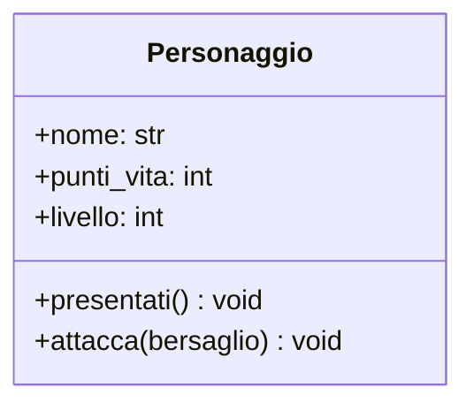

# Lezione 1: Dall'Idea al Progetto - Modellare con UML

Fino ad ora abbiamo scritto programmi seguendo un flusso di istruzioni. Ora, cambieremo prospettiva: inizieremo a pensare in termini di **oggetti**, entità autonome che hanno proprie caratteristiche e sanno compiere azioni.

## 1. Un Nuovo Modo di Pensare: La Programmazione a Oggetti

La **Programmazione Orientata agli Oggetti (OOP)** non si concentra sul "come" risolvere un problema passo-passo, ma sul **"chi"** è responsabile di fare cosa.

*   **Paradigma Imperativo (come abbiamo fatto finora):** Scriviamo una ricetta dettagliata. "Prendi le uova, rompile, aggiungi lo zucchero...".
*   **Paradigma a Oggetti:** Immaginiamo di avere degli "assistenti" specializzati. C'è un `Pasticciere`, un `Fornaio`, un `Decoratore`. Invece di scrivere la ricetta, diciamo al `Pasticciere`: "Prepara una torta". Sarà lui, con le sue competenze e i suoi ingredienti, a eseguire il compito.

Nel nostro "progetto fil rouge", un gioco di ruolo, non penseremo a una sequenza di comandi, ma ai protagonisti:
*   Chi c'è nel nostro gioco? Un **`Personaggio`**, dei **`Nemici`**.
*   Cosa sanno fare? Sanno **`attaccare`**, **`difendersi`**, **`usare_oggetti`**.
*   Che caratteristiche hanno? Hanno un **`nome`**, dei **`punti_vita`**, un **`livello`**.

In OOP, uniamo dati (caratteristiche) e comportamenti (azioni) in un unico contenitore chiamato **oggetto**.

## 2. Il Linguaggio dei Progettisti: UML

Prima di costruire una casa, un architetto ne disegna il progetto. Prima di scrivere un programma a oggetti, un programmatore ne disegna il modello. Il linguaggio standard per farlo è **UML (Unified Modeling Language)**.

A noi interessa una piccola ma potentissima parte di UML: il **Diagramma delle Classi**.

Un diagramma delle classi è una rappresentazione grafica che ci permette di definire il "progetto" (la **Classe**) da cui poi creeremo i nostri oggetti concreti.

## 3. La Nostra Prima Classe in UML: Il `Personaggio`

Partiamo da una semplice descrizione testuale (i **requisiti**):

> Vogliamo creare un personaggio per il nostro gioco. Un `Personaggio` ha un **`nome`**, 100 **`punti vita`** e parte dal **`livello`** 1. Deve poter **`attaccare`** e **`presentarsi`**.

Traduciamo questi requisiti in un diagramma UML. Una classe in UML è un rettangolo diviso in tre sezioni:

1.  **Nome della Classe:** In alto, in grassetto.
2.  **Attributi (Dati):** Al centro, le caratteristiche.
3.  **Metodi (Azioni):** In basso, i comportamenti.

Ecco il diagramma UML per la nostra classe `Personaggio`:

### Come si legge questo diagramma:
*   `class Personaggio`: Stiamo definendo il progetto per un tipo di oggetto chiamato "Personaggio".
*   `+ nome: str`: Ha un attributo chiamato `nome`, che sarà di tipo stringa. Il `+` indica che è **pubblico** (accessibile dall'esterno).
*   `+ punti_vita: int`: Ha un attributo `punti_vita` di tipo intero.
*   `+ livello: int`: Ha un attributo `livello` di tipo intero.
*   `+ presentati() void`: Ha un metodo (un'azione) chiamato `presentati`. Non richiede parametri e non restituisce (`void`) alcun valore, si limiterà a eseguire un'azione (come stampare un messaggio).
*   `+ attacca(bersaglio) void`: Ha un metodo `attacca` che richiede un `bersaglio` per funzionare.

Questo semplice diagramma è il nostro progetto. Ora siamo pronti per passare alla fase di costruzione: scrivere il codice Python.