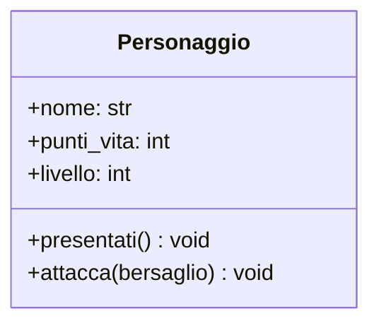

# Lezione 2: Dal Progetto al Codice - La Sintassi `class`

Abbiamo il nostro progetto UML per la classe `Personaggio`. Ora, vediamo come "costruirla" usando il codice Python. La traduzione da un diagramma UML di base a una classe Python è quasi diretta.

## 1. Tradurre UML in Codice Python

Ecco di nuovo il nostro diagramma:



E questa è la sua implementazione in Python:

```python
class Personaggio:
    # Questo è il costruttore, che vedremo in dettaglio nel prossimo modulo.
    # Per ora, usiamolo per definire gli attributi di ogni oggetto.
    def __init__(self, nome: str):
        self.nome: str = nome
        self.punti_vita: int = 100
        self.livello: int = 1

    # Traduzione del metodo presentati()
    def presentati(self) -> None:
        print(f"Sono {self.nome}, un eroe di livello {self.livello}!")

    # Traduzione del metodo attacca()
    def attacca(self, bersaglio) -> None:
        print(f"{self.nome} attacca {bersaglio.nome}!")
        # La logica del danno verrà aggiunta in futuro
```

Analizziamo la corrispondenza:
*   `class Personaggio`: La dichiarazione della classe in UML corrisponde a `class Personaggio:`.
*   **Attributi:** Gli attributi UML (`nome`, `punti_vita`, `livello`) diventano **attributi di istanza** in Python, definiti nel costruttore `__init__` e preceduti da `self.`.
*   **Metodi:** I metodi UML (`presentati`, `attacca`) diventano **metodi di istanza** in Python, ovvero funzioni definite dentro la classe che accettano `self` come primo parametro.

### Cos'è `self`?
`self` è una variabile speciale che rappresenta **l'oggetto specifico** su cui il metodo viene chiamato. Quando scriviamo `eroe1.presentati()`, `self` all'interno del metodo `presentati` si riferirà proprio a `eroe1`. Se chiamiamo `eroe2.presentati()`, `self` si riferirà a `eroe2`. È il modo con cui un oggetto accede a sé stesso.

## 2. Attributi di Istanza vs. Attributi di Classe

Gli attributi che abbiamo definito con `self.` sono **attributi di istanza**, perché ogni oggetto (istanza) avrà la sua copia personale. Se creiamo due personaggi, `eroe1` ed `eroe2`, ognuno avrà il suo `nome` e i suoi `punti_vita`.

Esistono anche gli **attributi di classe**, che sono condivisi da *tutti* gli oggetti creati da quella classe. Si definiscono direttamente sotto la dichiarazione della classe.

```python
class Personaggio:
    # Attributo di classe: tutti i personaggi appartengono allo stesso gioco
    nome_gioco = "Le Cronache di Pythonia"

    def __init__(self, nome: str):
        # Attributi di istanza
        self.nome: str = nome
        self.punti_vita: int = 100
```

## 3. Metodi di Istanza, di Classe e Statici

*   **Metodi di Istanza (i più comuni):** Lavorano sui dati di un oggetto specifico (`self`). Esempi: `attacca()`, `subisci_danno()`.

*   **Metodi di Classe:** Lavorano sui dati della classe (`cls`), non di un singolo oggetto. Si dichiarano con il decoratore `@classmethod`. Sono utili per creare "costruttori alternativi".

    ```python
    @classmethod
    def crea_personaggio_base(cls, nome: str):
        # 'cls' qui è come dire 'Personaggio'
        return cls(nome)
    ```

*   **Metodi Statici:** Sono funzioni logicamente collegate alla classe, ma che **non dipendono né dallo stato della classe né da quello di un oggetto**. Non ricevono né `cls` né `self`. Si dichiarano con `@staticmethod`.

    ```python
    @staticmethod
    def calcola_danno_critico(danno_base: int) -> int:
        return danno_base * 2
    ```
    Questa funzione è utile nel contesto del `Personaggio`, ma non ha bisogno di sapere il nome o i punti vita di un personaggio specifico per funzionare.