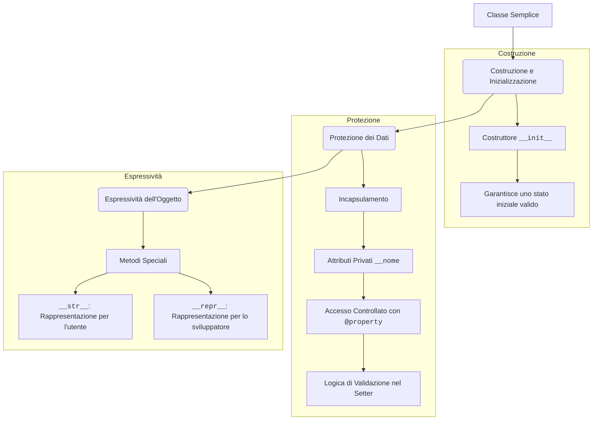

# Mappa Concettuale: Costruzione delle Classi

Questa mappa illustra come trasformare una classe semplice in un componente software robusto, controllando come viene creata, come i suoi dati vengono protetti e come si presenta al mondo esterno.

