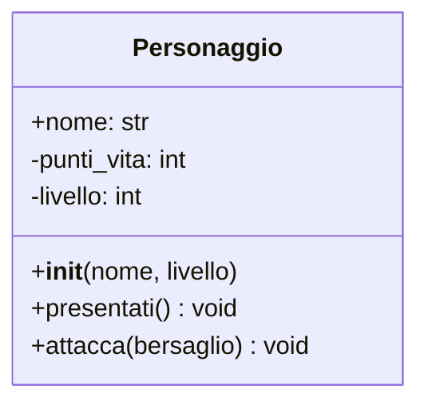

# Lezione 1: Costruttori e Incapsulamento

Nel modulo precedente abbiamo creato una classe `Personaggio`, ma la sua creazione e gestione dei dati è ancora fragile. Vediamo come renderla più solida.

## 1. Il Metodo Speciale `__init__`: Il Costruttore

Finora, per creare un personaggio, abbiamo fatto così:

```python
eroe = Personaggio()
eroe.nome = "Aragorn" # Imposto gli attributi dopo la creazione
```

Questo approccio è scomodo e soggetto a errori: potremmo dimenticarci di impostare un attributo fondamentale. La soluzione è il **costruttore**, un metodo speciale chiamato `__init__` che viene eseguito **automaticamente** ogni volta che creiamo un nuovo oggetto.

Il suo scopo è **inizializzare lo stato dell'oggetto**, ovvero impostare i valori iniziali dei suoi attributi.

```python
class Personaggio:
    # Il costruttore accetta i parametri necessari per creare l'oggetto
    def __init__(self, nome: str, livello: int):
        print(f"È nato un nuovo eroe: {nome}!")
        self.nome = nome
        self.punti_vita = 100
        self.livello = livello

# Ora la creazione è più pulita e sicura
eroe = Personaggio(nome="Aragorn", livello=5)
# L'output sarà: È nato un nuovo eroe: Aragorn!
```

Con il costruttore, garantiamo che ogni oggetto `Personaggio` nasca già con tutti gli attributi necessari.

## 2. Il Principio dell'Incapsulamento

Ora abbiamo un altro problema. Cosa succede se qualcuno scrive questo codice?

```python
eroe.punti_vita = -50 # Un valore senza senso!
```

Nulla glielo impedisce. Per evitare accessi diretti e incontrollati ai dati interni di un oggetto, usiamo l'**incapsulamento**.

L'incapsulamento consiste nel "nascondere" gli attributi, rendendoli **privati**, e fornire dei metodi pubblici per interagire con essi in modo controllato.

In Python, per convenzione, un attributo è considerato privato se il suo nome inizia con un doppio underscore (`__`).

```python
class Personaggio:
    def __init__(self, nome: str, livello: int):
        self.nome = nome # Attributo pubblico
        self.__punti_vita = 100 # Attributo PRIVATO
        self.__livello = livello # Attributo PRIVATO
```

Se ora proviamo ad accedere a `eroe.__punti_vita`, Python ci darà un `AttributeError`. I dati sono protetti!

## 3. Aggiornare il Diagramma UML

L'incapsulamento si riflette anche nel nostro progetto UML. La **visibilità** di attributi e metodi viene indicata con dei simboli:
*   `+` : Pubblico (accessibile da chiunque)
*   `-` : Privato (accessibile solo dalla classe stessa)
*   `#` : Protetto (un concetto legato all'ereditarietà, che vedremo più avanti)

Il nostro diagramma `Personaggio` aggiornato diventa così:


Abbiamo reso `punti_vita` e `livello` privati, proteggendoli da modifiche esterne incontrollate. Nella prossima lezione vedremo come interagire con questi dati in modo sicuro.