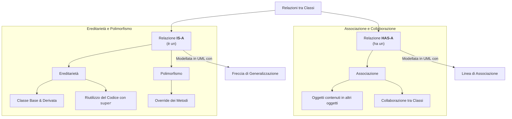

# Mappa Concettuale: Relazioni tra Classi

Questa mappa mostra i due modi principali con cui le classi possono interagire, formando la struttura portante di un'applicazione a oggetti.

```mermaid
graph TD
    A[Relazioni tra Classi] --> B["Relazione <b>IS-A</b><br/>(è un)"];
    A --> C["Relazione <b>HAS-A</b><br/>(ha un)"];

    subgraph Ereditarietà e Polimorfismo
        B --> B1[Ereditarietà];
        B --> B2[Polimorfismo];
        B1 --> B1a[Classe Base & Derivata];
        B1 --> B1b[Riutilizzo del Codice con <code>super</code>];
        B2 --> B2a[Override dei Metodi];
    end

    subgraph Associazione e Collaborazione
        C --> C1[Associazione];
        C1 --> C1a[Oggetti contenuti in altri oggetti];
        C1 --> C1b[Collaborazione tra Classi];
    end

    B -- Modellata in UML con --> Z1[Freccia di Generalizzazione];
    C -- Modellata in UML con --> Z2[Linea di Associazione];

```