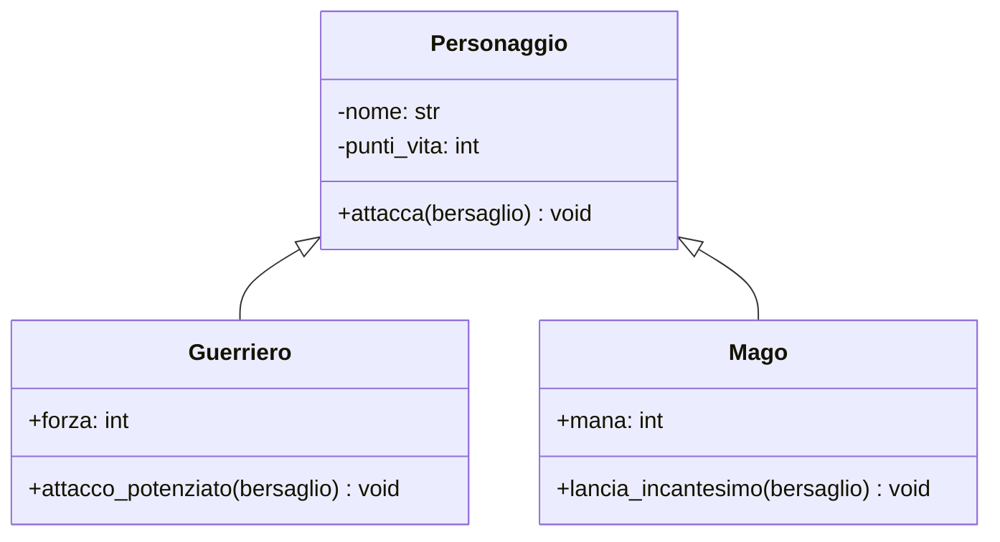

# Lezione 1: Ereditarietà e Polimorfismo (Relazione "IS-A")

Le classi possono essere legate tra loro da diverse relazioni. La più intuitiva è la relazione "è un", o **ereditarietà**.

## 1. Ereditarietà: Creare Specializzazioni

L'ereditarietà permette a una classe (detta **sottoclasse** o **classe derivata**) di ereditare attributi e metodi da un'altra classe (detta **superclasse** o **classe base**).

**Quando si usa?** Quando possiamo dire che una classe "è un" tipo specializzato di un'altra.
*   Un `Guerriero` **è un** `Personaggio`.
*   Un'`Auto` **è un** `Veicolo`.

Questo ci permette di:
1.  **Riutilizzare il codice:** Non dobbiamo riscrivere gli attributi comuni (`nome`, `punti_vita`) in ogni nuova classe.
2.  **Specializzare:** Possiamo aggiungere attributi e metodi unici alla sottoclasse.

### Notazione UML
In UML, l'ereditarietà si rappresenta con una freccia con la punta a triangolo vuoto, che va dalla sottoclasse alla superclasse.



### Implementazione in Python
La sintassi in Python è semplice: si indica la superclasse tra parentesi.

```python
# Classe Base
class Personaggio:
    def __init__(self, nome: str):
        self.nome = nome
        self._punti_vita = 100

    def attacca(self, bersaglio) -> None:
        print(f"{self.nome} attacca genericamente {bersaglio.nome}.")

# Classe Derivata
class Guerriero(Personaggio):
    def __init__(self, nome: str, forza: int):
        # Chiama il costruttore della classe base per inizializzare nome e punti_vita
        super().__init__(nome)
        self.forza = forza # Aggiunge il suo attributo specifico

    def attacco_potenziato(self, bersaglio) -> None:
        print(f"{self.nome} usa la sua forza ({self.forza}) per un attacco potenziato su {bersaglio.nome}!")

guerriero = Guerriero("Conan", 18)
guerriero.attacca(un_nemico) # Metodo ereditato da Personaggio
guerriero.attacco_potenziato(un_nemico) # Metodo specifico di Guerriero
```
La funzione `super()` è il modo corretto per richiamare un metodo della classe genitore.

## 2. Polimorfismo: Stessa Azione, Comportamenti Diversi

Il **polimorfismo** (dal greco "molte forme") è la capacità di oggetti di classi diverse di rispondere allo stesso messaggio (cioè alla stessa chiamata di metodo) in modi diversi.

Si implementa tramite l'**override dei metodi**: una sottoclasse ridefinisce un metodo ereditato dalla superclasse per adattarlo al suo comportamento specifico.

```python
class Mago(Personaggio):
    def __init__(self, nome: str, mana: int):
        super().__init__(nome)
        self.mana = mana

    # OVERRIDE del metodo attacca
    def attacca(self, bersaglio) -> None:
        if self.mana >= 10:
            self.mana -= 10
            print(f"{self.nome} lancia una palla di fuoco contro {bersaglio.nome}!")
        else:
            print(f"{self.nome} non ha abbastanza mana per attaccare!")

# --- Esempio di polimorfismo in azione ---
guerriero = Guerriero("Conan", 18)
mago = Mago("Merlino", 50)
nemico = # ... un oggetto nemico

personaggi = [guerriero, mago]

# Cicliamo su una lista di oggetti diversi
for personaggio in personaggi:
    # Python sa quale metodo 'attacca()' chiamare in base al tipo di oggetto!
    personaggio.attacca(nemico)
```
Questo è incredibilmente potente: possiamo gestire una collezione di oggetti eterogenei (guerrieri, maghi, etc.) in modo uniforme, e ogni oggetto saprà come comportarsi correttamente.