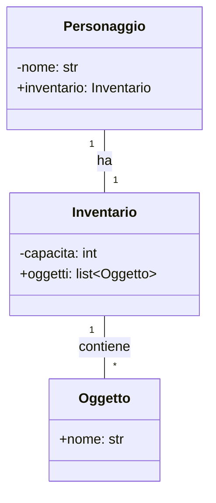

# Lezione 2: Associazioni e Collaborazione tra Oggetti (Relazione "HAS-A")

Non tutte le relazioni tra classi sono di tipo "è un". Molto spesso, un oggetto è "fatto di" o "ha un" altro oggetto. Questa è la relazione di **associazione**.

**Quando si usa?** Quando un oggetto contiene un altro oggetto come parte del suo stato.
*   Un'`Auto` **ha un** `Motore`.
*   Un `Personaggio` **ha un** `Inventario`.
*   Un `Inventario` **ha una** lista di `Oggetti`.

Questa relazione, che descrive la collaborazione tra oggetti, è spesso più flessibile e potente dell'ereditarietà.

## 1. Una Semplificazione Utile: L'Associazione

In UML esistono distinzioni più fini come la *composizione* (legame forte) e l'*aggregazione* (legame debole). Tuttavia, a livello pratico in Python, l'implementazione è quasi sempre la stessa: un oggetto ne contiene un altro come attributo.

Per questo motivo, semplificheremo e parleremo in generale di **Associazione** per descrivere qualsiasi relazione "HAS-A". Ci concentreremo sulla **cardinalità** (quanti oggetti sono coinvolti) per definire la natura del legame.

### Notazione UML
In UML, un'associazione si rappresenta con una linea continua che collega due classi. Le **cardinalità** (es. `1`, `*`, `0..1`) alle estremità della linea sono fondamentali per descrivere la relazione.


*Legenda:* Un `Personaggio` **ha un** `Inventario` (associazione 1-a-1). Un `Inventario` **contiene** zero o più `Oggetti` (associazione 1-a-molti).

## 2. Implementazione in Python

Implementare un'associazione è molto naturale in Python: l'oggetto contenitore ha un attributo che è un'istanza di un'altra classe.

```python
class Oggetto:
    def __init__(self, nome: str):
        self.nome = nome

    def __str__(self):
        return self.nome

class Inventario:
    def __init__(self, capacita: int = 10):
        self.capacita = capacita
        self.oggetti: list[Oggetto] = []

    def aggiungi_oggetto(self, oggetto: Oggetto):
        if len(self.oggetti) < self.capacita:
            self.oggetti.append(oggetto)
            print(f"'{oggetto.nome}' aggiunto all'inventario.")
        else:
            print("Inventario pieno!")

    def __str__(self):
        if not self.oggetti:
            return "L'inventario è vuoto."
        nomi_oggetti = ", ".join(str(o) for o in self.oggetti)
        return f"Inventario: [{nomi_oggetti}]"

class Personaggio:
    def __init__(self, nome: str):
        self.nome = nome
        # L'oggetto Personaggio è ASSOCIATO a un oggetto Inventario (Relazione "HAS-A")
        self.inventario = Inventario()

# --- Esempio di utilizzo ---
eroe = Personaggio("Lara")
print(eroe.inventario)

spada = Oggetto("Spada Lunga")
pozione = Oggetto("Pozione di Guarigione")

# Il personaggio interagisce con il suo oggetto interno
eroe.inventario.aggiungi_oggetto(spada)
eroe.inventario.aggiungi_oggetto(pozione)

print(eroe.inventario)
```

In questo esempio, `Personaggio` non sa come funziona internamente un `Inventario`, sa solo che "ne ha uno" e può usarne i metodi pubblici (`aggiungi_oggetto`). Questo è un esempio perfetto di **collaborazione tra oggetti**, un principio chiave della OOP.