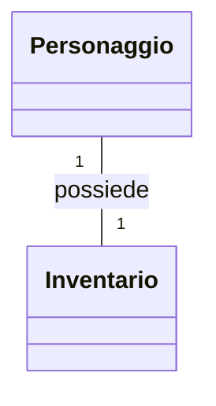
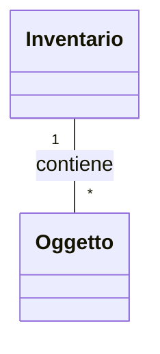
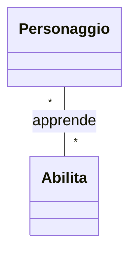

# Lezione 2: Associazioni e Collaborazione tra Oggetti (Relazione "HAS-A")

La relazione "HAS-A" (un oggetto "ha un" altro oggetto) è fondamentale nella OOP e si modella tramite **Associazioni**. A differenza dell'ereditarietà, che crea una gerarchia di "tipi", le associazioni descrivono come oggetti indipendenti collaborano tra loro.

Comprendere come implementare i diversi tipi di associazione è cruciale per tradurre un diagramma UML in codice funzionante.

## 1. Cardinalità e Direzionalità

Prima di scrivere il codice, dobbiamo capire due concetti chiave del nostro progetto UML:

*   **Cardinalità:** Indica *quanti* oggetti sono coinvolti in una relazione. Le più comuni sono `1` (esattamente uno), `*` (zero o più, cioè "molti") e `1..*` (uno o più).
*   **Direzionalità:** Indica *chi conosce chi*. Una freccia (`-->`) indica una navigazione unidirezionale (una classe conosce l'altra, ma non viceversa). Una linea semplice (`--`) indica una relazione bidirezionale (entrambe le classi si conoscono a vicenda).

Vediamo come implementare i tre casi principali nel contesto del nostro RPG.

---

## 2. Associazione Uno-a-Uno (1-a-1)

Un'istanza della Classe A è associata a una sola istanza della Classe B, e viceversa.

**Esempio RPG:** Ogni `Personaggio` ha esattamente un `Inventario`, e ogni `Inventario` appartiene a un solo `Personaggio`.

#### Diagramma UML


#### Implementazione in Python
Per una relazione bidirezionale, entrambe le classi devono avere un attributo per fare riferimento all'altra. È fondamentale gestire l'associazione in modo coerente da entrambi i lati.

```python
class Inventario:
    def __init__(self):
        self.capacita = 10
        self.oggetti = []
        self.proprietario = None # Riferimento al Personaggio

class Personaggio:
    def __init__(self, nome: str):
        self.nome = nome
        self.inventario = None # Inizialmente non ha inventario

    def assegna_inventario(self, inventario: "Inventario"):
        # Assegna l'inventario al personaggio
        self.inventario = inventario
        # E contemporaneamente, dice all'inventario chi è il suo proprietario
        if inventario.proprietario is not self:
            inventario.proprietario = self

# --- Utilizzo ---
eroe = Personaggio("Aragorn")
inventario_eroe = Inventario()

eroe.assegna_inventario(inventario_eroe)

print(f"Proprietario dell'inventario: {inventario_eroe.proprietario.nome}")
print(f"L'eroe {eroe.nome} ha un inventario con capacità {eroe.inventario.capacita}")
```

---

## 3. Associazione Uno-a-Molti (1-a-N)

Un'istanza della Classe A è associata a zero o più istanze della Classe B. Ogni istanza della Classe B è associata a una sola istanza della Classe A.

**Esempio RPG:** Un `Inventario` può contenere molti `Oggetti`, ma un `Oggetto` specifico si trova in un solo `Inventario` alla volta.

#### Diagramma UML


#### Implementazione in Python
La classe "uno" (`Inventario`) avrà una lista per contenere gli oggetti "molti" (`Oggetto`).

```python
class Oggetto:
    def __init__(self, nome: str):
        self.nome = nome
        self.contenitore = None # Riferimento all'Inventario

    def __str__(self):
        return self.nome

class Inventario:
    def __init__(self):
        self.oggetti: list[Oggetto] = [] # La lista per contenere i "molti"

    def aggiungi_oggetto(self, oggetto: Oggetto):
        self.oggetti.append(oggetto)
        oggetto.contenitore = self # Mantiene la coerenza
        print(f"'{oggetto.nome}' aggiunto all'inventario.")

    def mostra_contenuto(self):
        if not self.oggetti:
            print("L'inventario è vuoto.")
        else:
            nomi = ", ".join(str(o) for o in self.oggetti)
            print(f"Contenuto: [{nomi}]")

# --- Utilizzo ---
inventario = Inventario()
spada = Oggetto("Spada di Ferro")
scudo = Oggetto("Scudo di Legno")

inventario.aggiungi_oggetto(spada)
inventario.aggiungi_oggetto(scudo)

inventario.mostra_contenuto()
print(f"La {spada.nome} si trova in un inventario: {isinstance(spada.contenitore, Inventario)}")
```
---

## 4. Associazione Molti-a-Molti (N-a-N)

Un'istanza della Classe A può essere associata a più istanze della Classe B, e viceversa.

**Esempio RPG:** Un `Personaggio` può apprendere più `Abilita` (es. "Attacco Rapido", "Palla di Fuoco"), e una stessa `Abilita` può essere appresa da più `Personaggi`.

#### Diagramma UML


#### Implementazione in Python
Questa è la relazione più complessa. Entrambe le classi devono avere una lista per contenere i riferimenti all'altra. Sono necessari metodi specifici per creare il legame in modo consistente da entrambe le parti.

```python
# È necessario definire prima Personaggio per usarlo nel type hint di Abilita
class Personaggio:
    def __init__(self, nome: str):
        self.nome = nome
        # Lista di abilità conosciute da questo personaggio
        self.abilita_apprese: list[Abilita] = []

    def apprendi_abilita(self, abilita: "Abilita"):
        if abilita not in self.abilita_apprese:
            self.abilita_apprese.append(abilita) # Aggiunge l'abilità al personaggio
            abilita.aggiungi_utilizzatore(self) # E aggiunge il personaggio all'abilità
            print(f"{self.nome} ha appreso '{abilita.nome_abilita}'!")

class Abilita:
    def __init__(self, nome_abilita: str):
        self.nome_abilita = nome_abilita
        # Lista di personaggi che conoscono questa abilità
        self.utilizzatori: list[Personaggio] = []

    def aggiungi_utilizzatore(self, personaggio: Personaggio):
        if personaggio not in self.utilizzatori:
            self.utilizzatori.append(personaggio)

# --- Utilizzo ---
guerriero = Personaggio("Conan")
mago = Personaggio("Merlino")

attacco_rapido = Abilita("Attacco Rapido")
palla_di_fuoco = Abilita("Palla di Fuoco")

guerriero.apprendi_abilita(attacco_rapido)
mago.apprendi_abilita(palla_di_fuoco)
mago.apprendi_abilita(attacco_rapido) # Anche il mago può essere veloce!

print(f"\nAbilità di {guerriero.nome}: {[a.nome_abilita for a in guerriero.abilita_apprese]}")
print(f"Abilità di {mago.nome}: {[a.nome_abilita for a in mago.abilita_apprese]}")
print(f"Chi conosce '{attacco_rapido.nome_abilita}'? {[p.nome for p in attacco_rapido.utilizzatori]}")
```