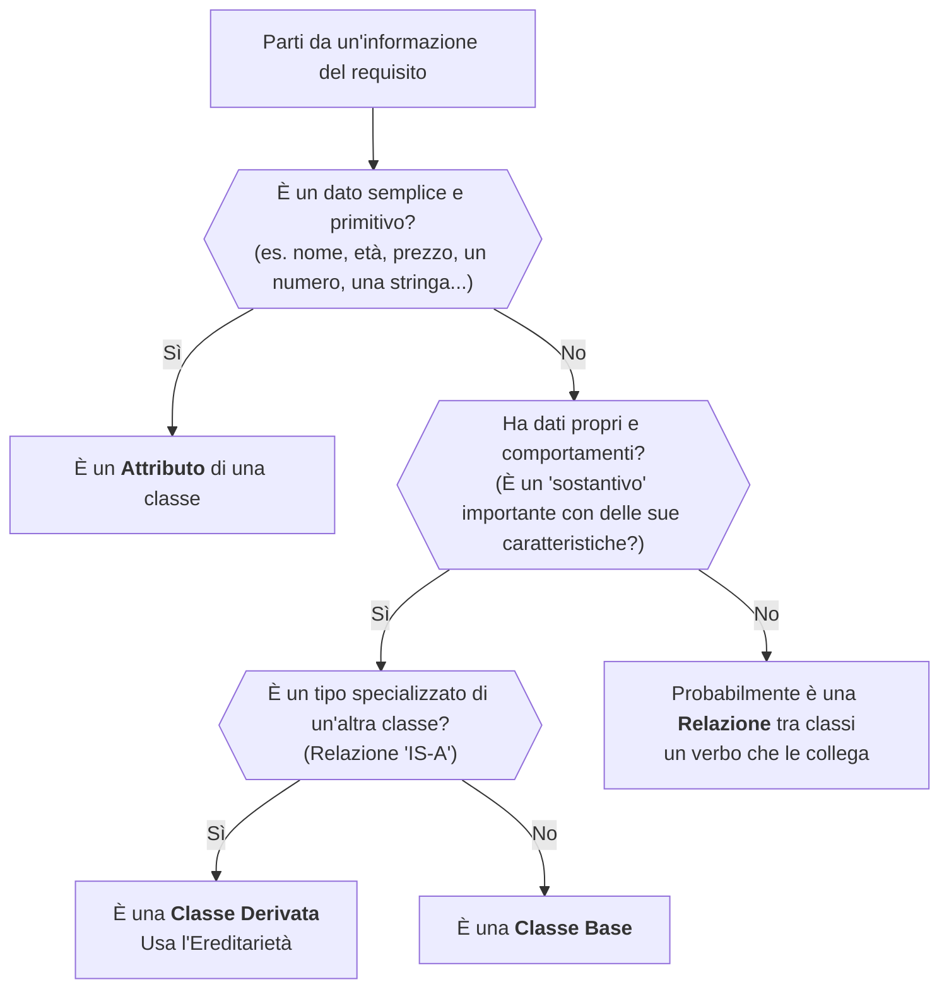
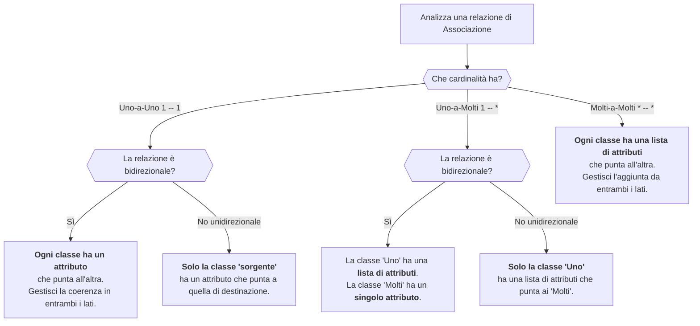

# Lezione 2: Il Processo di Modellazione - Una Guida Pratica

Abbiamo analizzato diversi scenari e creato diagrammi UML. Ora, formalizziamo il processo con due diagrammi di flusso che possono servirvi come una "checklist" o una guida passo-passo quando affrontate un nuovo problema di design, specialmente per il progetto finale.

## 1. Guida al Design: Dai Requisiti al Diagramma UML

Questo flowchart vi aiuta a decidere come trasformare le informazioni di un testo in elementi UML.

## 2. Guida all'Implementazione: Dal Diagramma UML al Codice Python

Una volta che avete il vostro diagramma UML, questo flowchart vi guida su come tradurre le associazioni in attributi Python.

