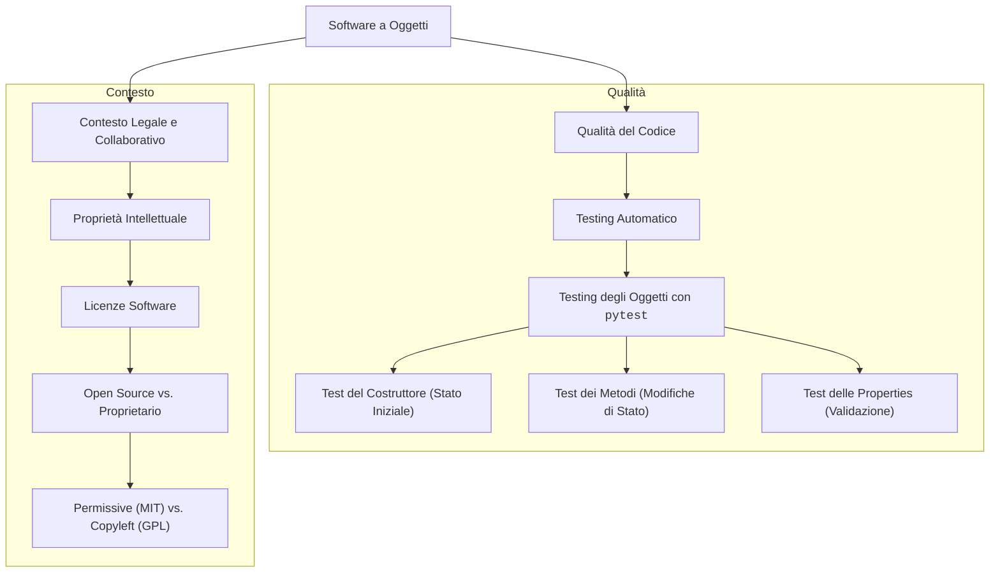

# Mappa Concettuale: Contesto e Qualità del Codice

Questa mappa mostra come, una volta costruito un sistema a oggetti, ci si assicura che funzioni correttamente (Qualità) e si definisce come può essere usato da altri (Contesto).

