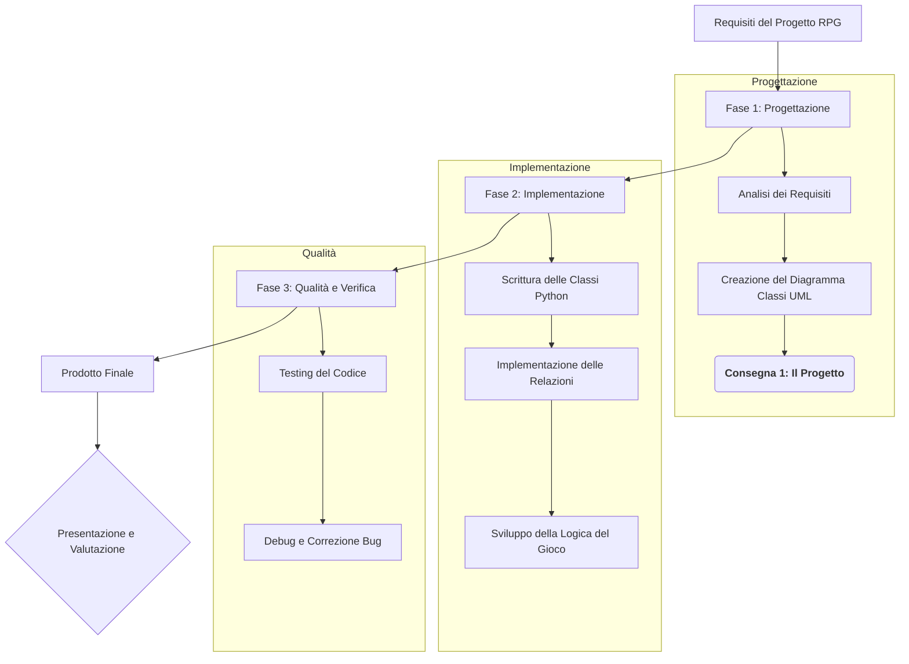

# Mappa Concettuale: Il Ciclo di Vita del Progetto Finale

Questa mappa illustra le fasi che trasformeranno i requisiti del progetto in un'applicazione software completa e funzionante, enfatizzando l'approccio "Design-First".

