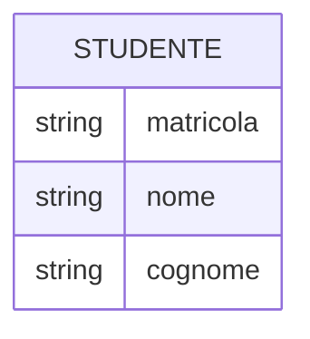
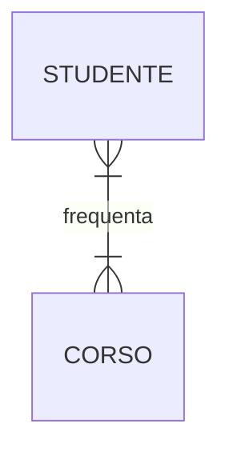
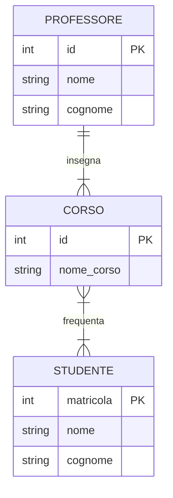

## Diagrammi Entità-Relazione (ER) <!-- omit in toc -->

- [Introduzione ai Diagrammi ER](#introduzione-ai-diagrammi-er)
- [Componenti Fondamentali](#componenti-fondamentali)
  - [Entità](#entità)
  - [Attributi](#attributi)
  - [Relazioni](#relazioni)
- [Cardinalità nelle Relazioni](#cardinalità-nelle-relazioni)
- [Esempio Completo di Diagramma ER](#esempio-completo-di-diagramma-er)

### Introduzione ai Diagrammi ER

I **Diagrammi Entità-Relazione (ER)** sono uno strumento visuale fondamentale per la modellazione concettuale dei dati. Sviluppati da Peter Chen nel 1976, forniscono una rappresentazione grafica chiara delle entità all'interno di un sistema, dei loro attributi e delle relazioni che le legano. Sono il ponte tra i requisiti testuali e la struttura logica del database.

### Componenti Fondamentali

#### Entità

Un'**entità** rappresenta un oggetto o un concetto del mondo reale che è rilevante per il nostro sistema (es. `Studente`, `Corso`). Nei diagrammi, le entità sono raffigurate come rettangoli.

#### Attributi

Gli **attributi** sono le proprietà o caratteristiche di un'entità (es. `nome`, `matricola` per uno `Studente`).

#### Relazioni

Le **relazioni** descrivono come le entità sono collegate tra loro. Sono rappresentate da linee che connettono le entità, spesso con un'etichetta che descrive l'azione (un verbo).

### Cardinalità nelle Relazioni

La **cardinalità** specifica il numero di istanze di un'entità che possono essere associate a un'istanza dell'altra entità. Le cardinalità più comuni sono:

- **Uno a Uno (1:1)**: Un `Preside` dirige una `Scuola`.
- **Uno a Molti (1:N)**: Un `Docente` insegna a molti `Studenti`.
- **Molti a Molti (M:N)**: Molti `Studenti` frequentano molti `Corsi`.

In Mermaid, la notazione per la cardinalità è la seguente:

- `|o--`: Uno o zero
- `||--`: Esattamente uno
- `}o--`: Molti o zero
- `}|--`: Molti e almeno uno

### Esempio Completo di Diagramma ER

Ecco un diagramma ER per un semplice sistema universitario:

Questo diagramma ci dice che:

- Un `Professore` può insegnare uno o più `Corsi`. Un `Corso` è tenuto da un solo `Professore`.
- Uno `Studente` può frequentare molti `Corsi`. Un `Corso` può essere frequentato da molti `Studenti`.
