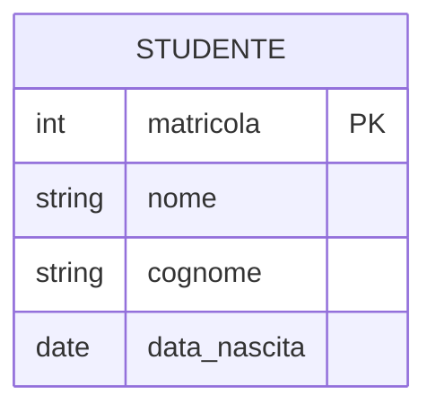
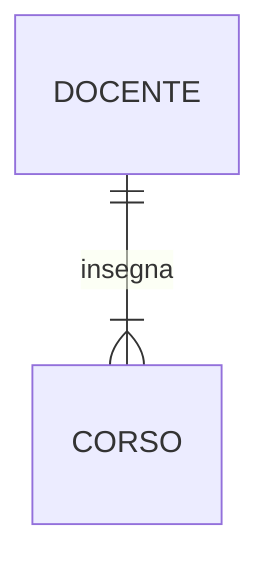
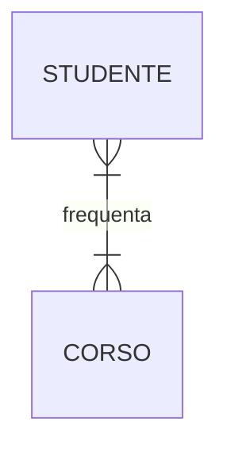

# Dal Diagramma ER al Codice SQL: Una Guida Pratica alla Traduzione

Abbiamo imparato a progettare la struttura dei nostri dati usando i Diagrammi Entità-Relazione (ER). Ora, vediamo come trasformare quel progetto visuale in una vera e propria struttura di database utilizzando il linguaggio SQL.

Questo processo di traduzione non è magico, ma segue delle regole precise. Se le impari, sarai in grado di tradurre qualsiasi diagramma ER in codice `CREATE TABLE` senza errori.

---

### Regola #1: Ogni Entità diventa una Tabella

Questa è la regola più semplice: ogni rettangolo nel tuo diagramma ER corrisponde a una tabella nel tuo database.

**Diagramma ER:**


**Traduzione SQL:**
```sql
CREATE TABLE Studente (
    -- le colonne verranno definite qui...
);
```

---

### Regola #2: Ogni Attributo diventa una Colonna

Ogni attributo elencato all'interno di un'entità nel diagramma diventa una colonna nella tabella corrispondente. Durante questa fase, definiamo anche il **tipo di dato** e i **vincoli** di base come `PRIMARY KEY` e `NOT NULL`.

**Diagramma ER:**


**Traduzione SQL:**
```sql
CREATE TABLE Studente (
    matricola INT PRIMARY KEY,
    nome VARCHAR(50) NOT NULL,
    cognome VARCHAR(50) NOT NULL,
    data_nascita DATE
);
```

---

### Regola #3: Le Relazioni 1-a-N si traducono con una Foreign Key

Questa è la regola fondamentale per creare i collegamenti. In una relazione "uno a molti", la tabella sul lato "molti" deve contenere un riferimento alla tabella sul lato "uno". Questo riferimento è la **chiave esterna (Foreign Key)**.

**Diagramma ER:** (Un `Docente` insegna molti `Corsi`)


**Traduzione SQL:** La chiave esterna (`docente_id`) viene aggiunta alla tabella `CORSO` (il lato "molti").

```sql
CREATE TABLE Docente (
    id INT PRIMARY KEY,
    nome VARCHAR(50) NOT NULL
);

CREATE TABLE Corso (
    id INT PRIMARY KEY,
    nome_corso VARCHAR(100) NOT NULL,
    docente_id INT,
    FOREIGN KEY (docente_id) REFERENCES Docente(id)
);
```
Questa struttura garantisce che ogni corso sia collegato a un solo docente, ma un docente possa essere associato a più corsi.

---

### Regola #4: Le Relazioni N-a-N si traducono con una Tabella di Raccordo

Una relazione "molti a molti" non può essere rappresentata direttamente in un database relazionale. La soluzione è creare una terza tabella, chiamata **tabella di raccordo** (o _junction table_), che collega le due entità.

**Diagramma ER:** (Molti `Studenti` frequentano molti `Corsi`)


**Traduzione SQL:** Creiamo una nuova tabella `Iscrizione`. Questa tabella conterrà due chiavi esterne: una che punta a `Studente` e una che punta a `Corso`. La loro combinazione formerà la chiave primaria della tabella di raccordo.

```sql
CREATE TABLE Studente (
    id INT PRIMARY KEY,
    nome VARCHAR(50) NOT NULL
);

CREATE TABLE Corso (
    id INT PRIMARY KEY,
    nome_corso VARCHAR(100) NOT NULL
);

-- La Tabella di Raccordo
CREATE TABLE Iscrizione (
    studente_id INT,
    corso_id INT,
    PRIMARY KEY (studente_id, corso_id),
    FOREIGN KEY (studente_id) REFERENCES Studente(id),
    FOREIGN KEY (corso_id) REFERENCES Corso(id)
);
```

Seguendo queste quattro regole, puoi tradurre sistematicamente qualsiasi progetto concettuale in una struttura logica e fisica pronta per essere implementata.