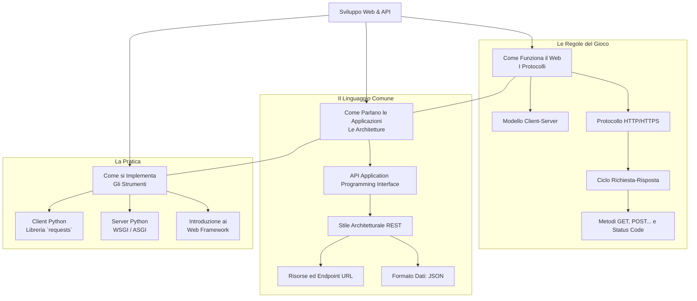

# Mappa Concettuale: Basi dello Sviluppo Web e API REST

Questa mappa delinea i due pilastri concettuali del modulo: il protocollo di comunicazione HTTP e lo stile architetturale per l'interazione tra applicazioni API REST.

