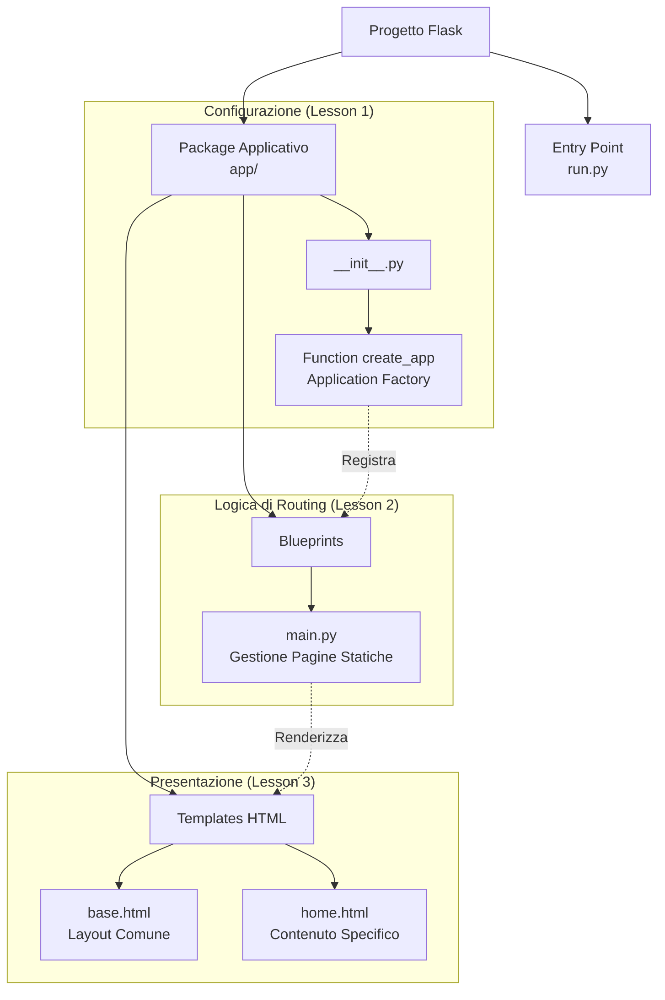

# Mappa Concettuale: Architettura Web con Flask

Questa mappa illustra la struttura "professionale" che adotteremo fin dal primo giorno, separando la configurazione, la logica delle route e la visualizzazione.

