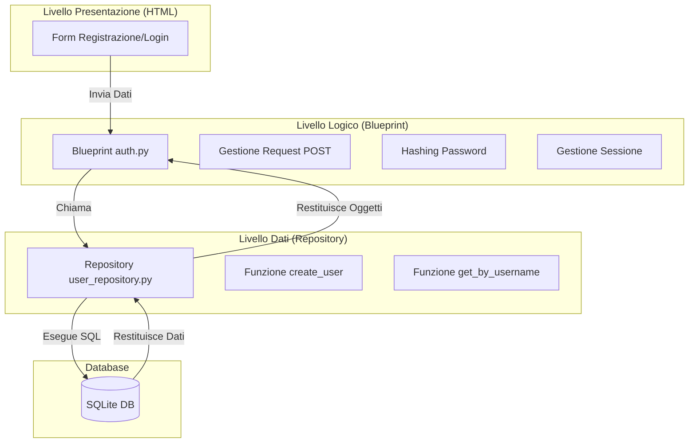

# Mappa Concettuale: Accesso Dati e Autenticazione

Questa mappa evidenzia l'architettura a tre livelli che implementiamo: Presentazione, Logica Applicativa e Accesso ai Dati.

```mermaid
graph TD
    subgraph "Livello Presentazione (HTML)"
        A[Form Registrazione/Login];
    end

    subgraph "Livello Logico (Blueprint)"
        B[Blueprint auth.py];
        B1[Gestione Request POST];
        B2[Hashing Password];
        B3[Gestione Sessione];
    end

    subgraph "Livello Dati (Repository)"
        C[Repository user_repository.py];
        C1[Funzione create_user];
        C2[Funzione get_by_username];
    end

    subgraph "Database"
        D[(SQLite DB)];
    end

    A -->|Invia Dati| B;
    B -->|Chiama| C;
    C -->|Esegue SQL| D;
    D -->|Restituisce Dati| C;
    C -->|Restituisce Oggetti| B;
```