# Mappa Concettuale: Architettura Modulare con Flask

Questa mappa illustra il processo di trasformazione di un'applicazione Flask da un progetto monolitico e disorganizzato a una struttura professionale, scalabile e di facile manutenzione.

```mermaid
graph TD
    A["Applicazione Monolitica<br>`flask_1`"] --> B["Problema&colon;<br>Un unico grande file `app.py`"];
    B --> C["Principio Guida&colon;<br>**Separazione delle Responsabilità**"];
    C --> D["Soluzione Architetturale"];

    subgraph "Struttura a Pacchetto"
        D --> D1["Application Factory<br>`create_app&lpar;&rpar;` in `__init__.py`"];
        D1 --> D2["Separazione delle Route<br>con **Blueprints**"];
        D2 --> D3["Moduli Funzionali<br>`auth.py`&comma; `posts.py`"];
    end

    D --> E["Applicazione Modulare<br>`flask_2`"];
    E --> F["Documentazione dell'Architettura<br>con Diagramma Classi UML"];
```

