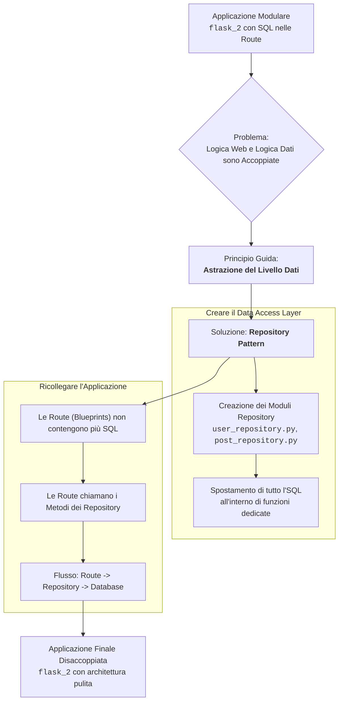

# Mappa Concettuale: Architettura del Livello Dati (Repository Pattern)

```mermaid
graph TD
    A[Applicazione Modulare<br><code>flask_2</code> con SQL nelle Route] --> B{Problema:<br>Logica Web e Logica Dati sono Accoppiate};
    B --> C[Principio Guida:<br><strong>Astrazione del Livello Dati</strong>];
    C --> D[Soluzione: <strong>Repository Pattern</strong>];

    subgraph "Creare il Data Access Layer"
        D --> D1[Creazione dei Moduli Repository<br><code>user_repository.py</code>, <code>post_repository.py</code>];
        D1 --> D2[Spostamento di tutto l'SQL<br>all'interno di funzioni dedicate];
    end

    subgraph "Ricollegare l'Applicazione"
        D --> E1[Le Route &lpar;Blueprints&rpar; non contengono più SQL];
        E1 --> E2[Le Route chiamano i Metodi dei Repository];
        E2 --> E3[Flusso: Route -> Repository -> Database];
    end
    
    E3 --> F[Applicazione Finale Disaccoppiata<br><code>flask_2</code> con architettura pulita];
```

