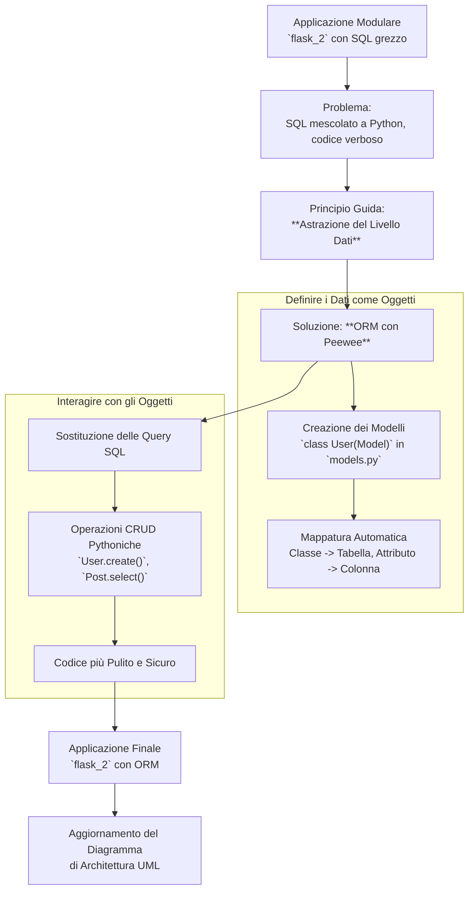

# Mappa Concettuale: Interazione con il Database tramite ORM

Questa mappa illustra il passaggio dal codice di accesso al database manuale e basato su SQL a un approccio moderno e orientato agli oggetti, utilizzando un Object-Relational Mapper (ORM).

