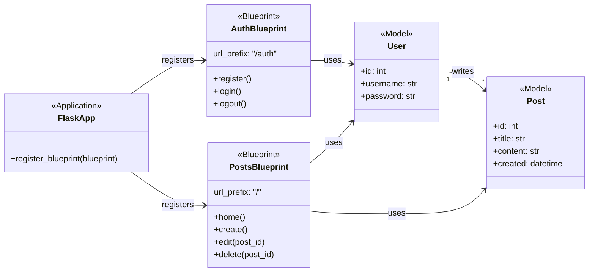

# Lezione 4: Aggiornare il Diagramma di Architettura con i Modelli ORM

Nel capitolo precedente, abbiamo creato un diagramma UML per descrivere l'architettura a Blueprints della nostra applicazione `flask_2`. Quel diagramma, però, era incompleto: mostrava i moduli logici (`AuthBlueprint`, `PostsBlueprint`) ma trattava il database come una "scatola nera".

Ora che abbiamo introdotto l'ORM e definito i nostri dati come **classi modello**, possiamo creare un diagramma di architettura molto più ricco e completo, che descrive l'intero sistema in modo professionale.

### 1. Cosa è Cambiato nella Nostra Architettura?

Il refactoring con Peewee ha introdotto un nuovo livello di astrazione:
1.  Non abbiamo più un generico componente `Database`.
2.  Abbiamo invece delle **classi `<<Model>>`** specifiche (`User`, `Post`) che rappresentano le entità del nostro dominio.
3.  Le relazioni tra queste entità (es. un utente scrive più post) sono ora definite esplicitamente nel codice Python e possono essere rappresentate nel diagramma.
4.  I nostri Blueprints ora non dipendono più da un generico `db.py`, ma dipendono direttamente dai **modelli** con cui devono interagire.

### 2. Il Diagramma di Architettura Finale per `flask_2`

Ecco il diagramma UML aggiornato che rappresenta la nostra applicazione completa, con Blueprints e ORM.

### 3. Come Leggere e Spiegare il Diagramma Aggiornato

Questo diagramma è molto più potente del precedente e racconta una storia completa:

1.  **Struttura Applicativa (a sinistra):** L'applicazione (`FlaskApp`) è composta da due moduli logici (`AuthBlueprint`, `PostsBlueprint`), ognuno con le sue responsabilità specifiche. Questa parte non è cambiata.

2.  **Struttura del Dominio (a destra):** Il "cuore" dei dati della nostra applicazione è rappresentato dai modelli `User` e `Post`. La linea solida tra di loro (`User "1" -- "*" Post`) descrive la **relazione fondamentale dei nostri dati**: un Utente può scrivere molti Post. Questa è una relazione **1-a-N**.

3.  **Dipendenze:** Le linee di dipendenza ora collegano i Blueprints direttamente ai Modelli che utilizzano.
    *   `AuthBlueprint` **usa** il modello `User` per creare nuovi utenti e per cercarli durante il login.
    *   `PostsBlueprint` **usa** sia il modello `Post` (per le operazioni CRUD sui post) sia il modello `User` (per verificare l'autore di un post).

**Questo diagramma unisce due viste in una:**
*   La **vista architetturale** (come è organizzato il software).
*   La **vista del dominio** (come sono strutturati e relazionati i dati).

