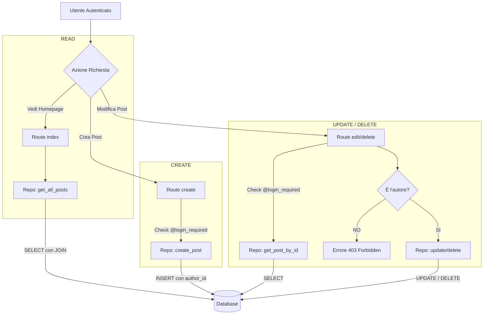

# Mappa Concettuale: Sviluppo CRUD e Relazioni

Questa mappa mostra il flusso completo per la gestione di un'entità complessa come i Post, integrando sicurezza e database.

```mermaid
graph TD
    A[Utente Autenticato] --> B{Azione Richiesta};

    subgraph "READ"
        B -->|Vedi Homepage| C[Route index];
        C --> D[Repo: get_all_posts];
    end

    subgraph "CREATE"
        B -->|Crea Post| E[Route create];
        E -->|Check @login_required| F[Repo: create_post];
    end

    subgraph "UPDATE / DELETE"
        B -->|Modifica Post| G[Route edit/delete];
        G -->|Check @login_required| H[Repo: get_post_by_id];
        G --> I{È l'autore?};
        I -- NO --> L[Errore 403 Forbidden];
        I -- SI --> M[Repo: update/delete];
    end

    D -->|SELECT con JOIN| DB[(Database)];
    F -->|INSERT con author_id| DB;
    H -->|SELECT| DB;
    M -->|UPDATE / DELETE| DB;
```