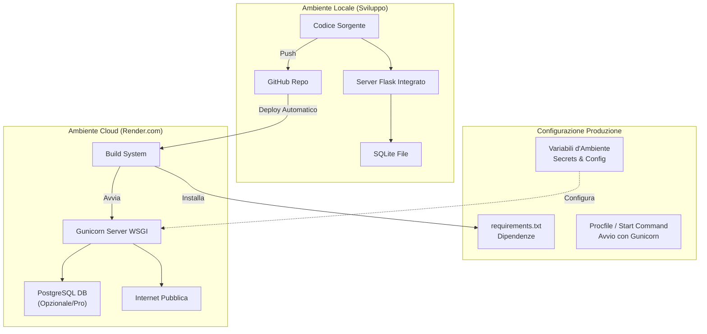

# Mappa Concettuale: Deployment e Produzione

Questa mappa illustra la trasformazione dell'ambiente, dal PC dello studente al Cloud.

```mermaid
graph TD
    subgraph "Ambiente Locale &lpar;Sviluppo&rpar;"
        A[Codice Sorgente] --> B[Server Flask Integrato];
        B --> C[SQLite File];
        A -->|Push| D[GitHub Repo];
    end

    subgraph "Configurazione Produzione"
        E[requirements.txt<br>Dipendenze];
        F[Procfile / Start Command<br>Avvio con Gunicorn];
        G[Variabili d'Ambiente<br>Secrets & Config];
    end

    subgraph "Ambiente Cloud &lpar;Render.com&rpar;"
        D -->|Deploy Automatico| H[Build System];
        H -->|Installa| E;
        H -->|Avvia| I[Gunicorn Server WSGI];
        G -.->|Configura| I;
        I --> L[PostgreSQL DB<br>&lpar;Opzionale/Pro&rpar;];
        I --> M[Internet Pubblica];
    end
```