# Mappa Concettuale: Backend con Flask - Le Basi

Questa mappa delinea il percorso di apprendimento per la costruzione di una prima applicazione web completa, partendo dai concetti fondamentali di Flask fino all'implementazione di un sistema di autenticazione e di gestione dei dati.

```mermaid
graph TD
    A[Flask&colon; Le Basi] --> B[1. Fondamenti e Setup];
    A --> C[2. Presentazione e Viste];
    A --> D[3. Dati e Persistenza];
    A --> E[4. Utenti e Sicurezza];

    subgraph "Iniziare il Progetto"
        B --> B1[Cos'è un Web Framework?];
        B1 --> B2[Struttura del Progetto app.py&comma; templates/&comma; static/];
        B2 --> B3[Routing @app.route&lpar;&rpar;];
    end

    subgraph "Creare l'Interfaccia"
        C --> C1[Templating con Jinja2 render_template];
        C1 --> C2[Logica nei Template &#123;% for %&#125;&comma; &#123;% if %&#125;];
        C2 --> C3[Ereditarietà &#123;% extends 'base.html' %&#125;];
    end

    subgraph "Interagire con i Dati"
        D --> D1[Connessione a SQLite];
        D1 --> D2[Visualizzare Dati SELECT];
        D2 --> D3[Gestire Form HTML request.form];
        D3 --> D4[Creare&comma; Modificare&comma; Eliminare INSERT&comma; UPDATE&comma; DELETE];
    end

    subgraph "Gestire gli Utenti"
        E --> E1[Autenticazione];
        E1 --> E2[Hashing delle Password werkzeug.security];
        E2 --> E3[Gestione delle Sessioni session&#91;'user_id'&#93;];
        E3 --> E4[Protezione delle Route @login_required];
    end

    B --> C --> D --> E;
```

