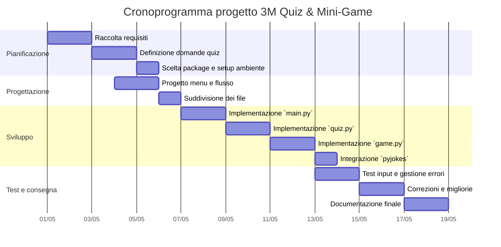

# Documento dei Requisiti - Progetto 3M Demo Quiz & Mini-Game

## 1. Titolo del progetto

Quiz & Mini-Game Console

## 2. Obiettivo

Il programma offre un menu a console che permette all'utente di giocare a un quiz a scelta multipla, sfidare il caso con un gioco di dadi e ricevere una barzelletta generata da un package Python esterno.

## 3. Attori

- Utente / Giocatore
- Sistema (console app)

## 4. Requisiti funzionali

- Avviare il programma con un menu principale
- Gestire in modo sicuro l'input dell'utente
- Consentire di giocare a un quiz a scelta multipla
- Consentire di giocare a un gioco casuale con i dadi
- Mostrare una barzelletta usando un package esterno (`pyjokes`)
- Calcolare e visualizzare il punteggio del quiz
- Offrire la possibilità di tornare al menu principale o uscire

## 5. Requisiti non funzionali

- Interfaccia a console chiara e leggibile
- Gestione degli errori di input per scelte non valide
- Codice organizzato in file separati (`main.py`, `quiz.py`, `game.py`, `utils.py`)
- Documentazione base nel repository

## 6. Scelta del package Python

- Package scelto: `pyjokes`
- Perché lo abbiamo scelto: permette di integrare un elemento di intrattenimento facilmente e dimostra l'uso di un package esterno nel progetto
- Come lo usiamo nel progetto: viene usato per generare e mostrare una barzelletta a richiesta dell'utente

## 7. Suddivisione del lavoro

- Studente A: implementazione del menu principale e controllo del flusso in `main.py`
- Studente B: sviluppo del quiz e calcolo del punteggio in `quiz.py`
- Studente C: sviluppo del mini-gioco dei dadi in `game.py` e utilità di input in `utils.py`

## 8. Flusso del programma

- Menu iniziale
  - 1) Gioca al quiz
  - 2) Gioca con i dadi
  - 3) Ricevi una barzelletta
  - 4) Esci
- Ogni funzione principale gestisce l'input dell'utente e ritorna al menu al termine
- Risultati e punteggi vengono mostrati in console

## 9. Cronoprogramma (Gantt semplificato)

- Settimana 1: definizione del progetto, selezione package, stesura requisiti e scelta delle domande
- Settimana 2: progettazione del menu, divisione dei file e implementazione di `main.py`
- Settimana 3: sviluppo del quiz, gioco dei dadi e integrazione di `pyjokes`
- Settimana 4: test, correzioni, rifinitura dell'output e documentazione

## 10. Note aggiuntive

- Il progetto può essere esteso con altri mini-giochi, domande del quiz aggiuntive, oppure un sistema di salvataggio dei risultati
- In futuro si potrebbe aggiungere un tema grafico in console con `colorama` per migliorare l'esperienza utente
