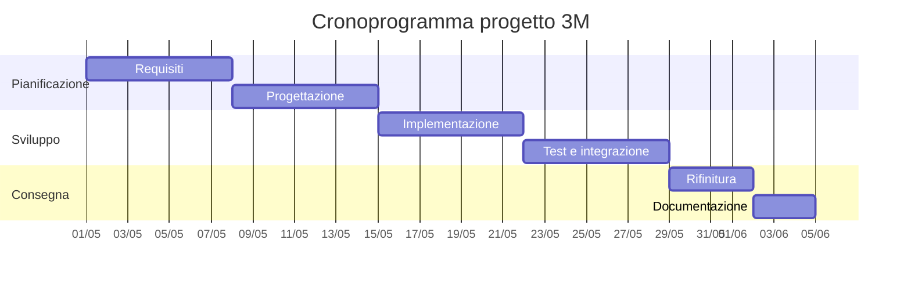

# Documento dei Requisiti - Progetto 3M

## 1. Titolo del progetto

Inserisci il titolo scelto dal gruppo.

## 2. Obiettivo

Descrivi brevemente cosa fa il programma e quale problema risolve.

## 3. Attori

- Utente / Giocatore
- Altro ruolo rilevante (se presente)

## 4. Requisiti funzionali

Elenca le funzionalità principali:
- Avviare il programma con un menu
- Gestire input dell'utente
- Eseguire almeno una funzione principale (quiz, simulatore, tool, ecc.)
- Usare almeno un package Python esterno
- Mostrare risultati o statistiche

## 5. Requisiti non funzionali

- Interfaccia a console chiara
- Gestione degli errori di input
- Codice organizzato in più file
- Commenti e documentazione base

## 6. Scelta del package Python

- Package scelto: `...`
- Perché lo abbiamo scelto: `...`
- Come lo usiamo nel progetto: `...`

## 7. Suddivisione del lavoro

- Studente A: `...`
- Studente B: `...`
- Studente C: `...`

## 8. Flusso del programma

Descrivi il menu e le schermate principali. Ad esempio:
- Menu iniziale
- Scelta del quiz o del gioco
- Risultati finali

## 9. Cronoprogramma (Gantt semplificato)

- Settimana 1: scelta del tema, ricerca package, stesura requisiti
- Settimana 2: progettazione, divisione del lavoro, avvio sviluppo
- Settimana 3: completamento funzionalità, test, integrazione package
- Settimana 4: rifinitura, documentazione, consegna

## 10. Note aggiuntive

Aggiungi qui commenti sul tema, sulle idee future o sulle difficoltà previste.
