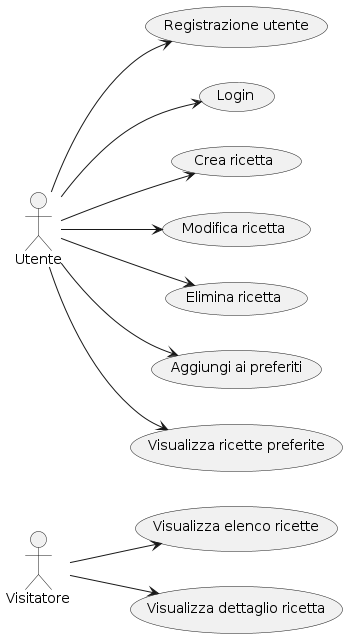
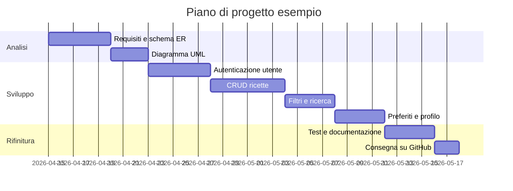
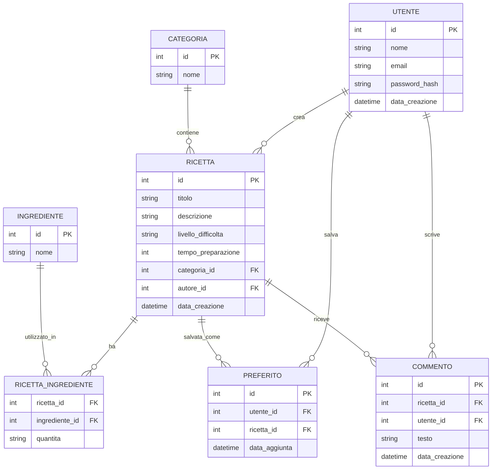
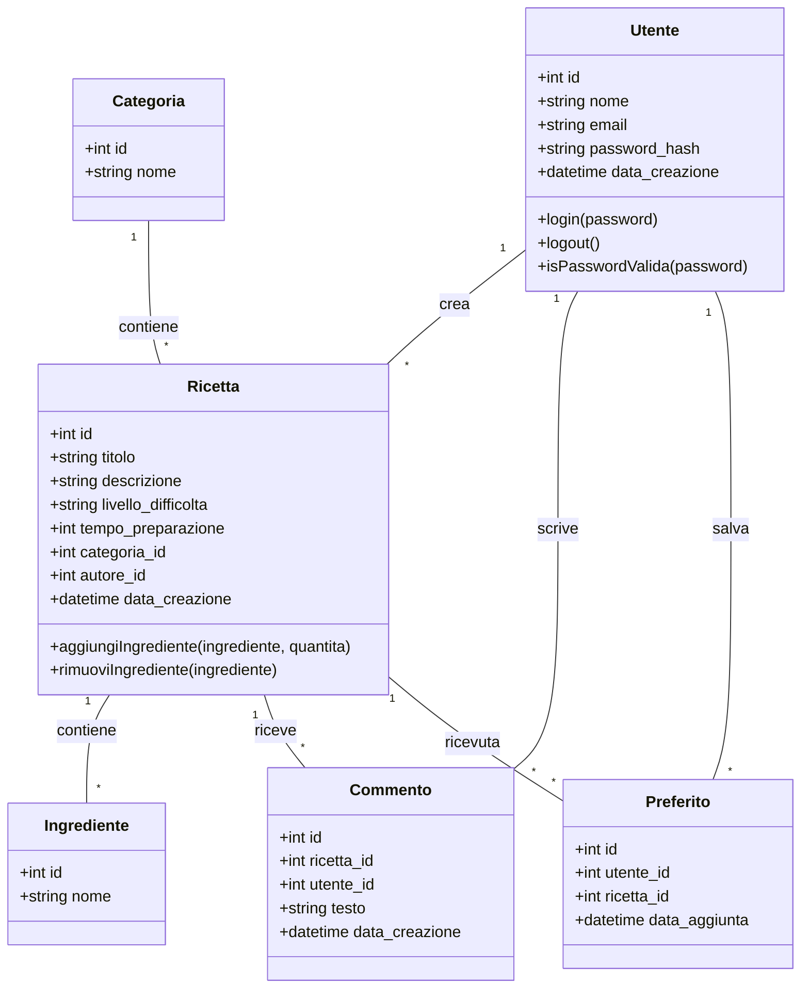

# Esempio di Documento dei Requisiti

> Questo esempio mostra come preparare un documento dei requisiti per un progetto di fine anno del modulo `03_Sviluppo_Web_e_Database`.
> Il tema è libero: qui usiamo un esempio pratico per un **ricettario digitale condiviso** (`RecipeHub`).

## 1. Introduzione

### 1.1 Scopo del documento

Lo scopo di questo documento è:
- descrivere in modo chiaro il prodotto che gli studenti dovranno realizzare;
- raccogliere i requisiti funzionali e non funzionali;
- fornire una prima progettazione concettuale e una roadmap di lavoro con diagrammi ER, UML e casi d'uso, organizzata nelle fasi di analisi, sviluppo e rifinitura;
- definire una roadmap di lavoro con milestone e attività principali.

### 1.2 Contesto

Gli studenti del quinto anno devono realizzare un piccolo progetto web con backend in Python/Flask e database relazionale. Il tema è libero, ma è consigliabile scegliere un prodotto che preveda:
- una gestione dati persistente;
- una parte di autenticazione e sicurezza;
- un'interfaccia web con visualizzazione dinamica;
- relazioni tra più tabelle nel database.

### 1.3 Tema d'esempio

Tema scelto per l'esempio: **RecipeHub**.
RecipeHub è un ricettario digitale in cui gli utenti possono creare, condividere e salvare ricette.

> Nota: il tema è un esempio. Gli studenti possono scegliere un progetto diverso, come un diario di allenamenti, un gestore di eventi, una wallet app o un catalogo personalizzato.

## 2. Obiettivi generali

- Permettere a un utente di registrarsi e autenticarsi.
- Consentire la creazione, modifica, eliminazione e visualizzazione delle ricette.
- Consentire la ricerca e il filtro delle ricette per categoria, difficoltà o tempo di preparazione.
- Permettere di salvare ricette tra i preferiti.
- Fornire una pagina di profilo dove l'utente vede le proprie ricette.

## 3. Stakeholder e attori

| Stakeholder | Ruolo | Interesse |
| --- | --- | --- |
| Studente | Sviluppatore | Realizzare il progetto rispettando i requisiti |
| Docente | Valutatore | Verificare correttezza tecnica e completezza |
| Utente finale | Studentessa o studente | Usare l'app per salvare e consultare ricette |

### Attori principali

- `Utente autenticato`
- `Visitatore` (utente non autenticato)
- `Amministratore` (opzionale, se si vuole aggiungere gestione contenuti)

## 4. Requisiti funzionali

### 4.1 Requisiti principali

1. Registrazione e login.
2. Creazione di una nuova ricetta con titolo, lista ingredienti, descrizione, categoria, tempo di preparazione, livello di difficoltà.
3. Visualizzazione dei dettagli di ogni ricetta.
4. Modifica ed eliminazione delle ricette create dall'utente.
5. Ricerca e filtro delle ricette.
6. Aggiunta di ricette ai preferiti.
7. Visualizzazione delle ricette preferite e delle proprie ricette.

### 4.2 User stories

- Come **utente**, voglio registrarmi e accedere affinché le mie ricette siano salvate sotto il mio account.
- Come **utente autenticato**, voglio creare una ricetta per condividerla con altri.
- Come **utente**, voglio cercare ricette per categoria in modo da trovare rapidamente quelle che mi interessano.
- Come **utente autenticato**, voglio salvare ricette ai preferiti per ritrovarle facilmente.
- Come **visitatore**, voglio vedere l'elenco delle ricette pubbliche senza dover fare il login.

## 5. Requisiti non funzionali

- L'app deve avere un'interfaccia semplice e chiara.
- Il login deve essere protetto con hashing delle password.
- Il backend deve usare un database relazionale (es. SQLite / PostgreSQL).
- Il codice deve essere organizzato con Blueprints e repository pattern.
- Deve essere possibile eseguire il progetto localmente con un ambiente virtuale Python.
- I dati devono essere persistenti tra una sessione e l'altra.

## 6. Casi d'uso

### 6.1 Casi d'uso essenziali

1. `Registrazione utente`
2. `Login`
3. `Visualizza elenco ricette`
4. `Visualizza dettaglio ricetta`
5. `Crea ricetta`
6. `Aggiungi ai preferiti`

### 6.2 Descrizione semplificata dei casi d'uso

- **Registrazione utente**: il visitatore inserisce nome, email e password; il sistema crea un account e apre la sessione.
- **Login**: l'utente inserisce email e password; il sistema verifica le credenziali e apre la sessione.
- **Visualizza elenco ricette**: il visitatore o l'utente autenticato vede la lista delle ricette pubbliche.
- **Visualizza dettaglio ricetta**: l'utente seleziona una ricetta dall'elenco e legge ingredienti, procedimento e metadati.
- **Crea ricetta**: l'utente autenticato compila un form con titolo, ingredienti, procedimento e categorie; il sistema salva la ricetta.
- **Aggiungi ai preferiti**: l'utente autenticato salva una ricetta tra i preferiti durante la visualizzazione dei dettagli.

### 6.3 Relazioni tra casi d'uso: include ed extend

In un diagramma dei casi d'uso si usano due tipi di relazioni aggiuntive:

- `<<include>>`: rappresenta un comportamento obbligatorio riutilizzabile. Un caso d'uso base include un altro caso d'uso quando il suo comportamento è sempre eseguito.
- `<<extend>>`: rappresenta un comportamento opzionale o alternativo che si aggiunge al caso d'uso base solo in certe condizioni.

I casi d'uso non devono essere confusi con i rapporti tra attori. Nel nostro esempio, `Utente` è un attore specializzato di `Visitatore`: l'utente può fare tutto ciò che può fare un visitatore, più alcune azioni aggiuntive. Questo si modella con una generalizzazione tra attori, non con `include` o `extend`.

Per questo progetto, le relazioni principali sono:

- `Crea ricetta` <<include>> `Verifica autenticazione`
- `Aggiungi ai preferiti` <<include>> `Verifica autenticazione`

Queste relazioni indicano che l'autenticazione è un passaggio obbligatorio per tutti i casi d'uso che accedono ai dati personali.

Esempi di `extend`:

- `Recupero password` <<extend>> `Login`: l'utente può richiedere il recupero password solo quando non ricorda le credenziali.
- `Aggiungi ai preferiti` <<extend>> `Visualizza dettaglio ricetta`: aggiungere una ricetta ai preferiti è un'azione opzionale che si attiva quando l'utente visualizza i dettagli di una ricetta.

Aggiungendo queste relazioni, il diagramma diventa più preciso e mette in evidenza i comportamenti comuni e le estensioni opzionali.

### 6.4 Diagramma dei casi d'uso

Il diagramma dei casi d'uso è stato generato come immagine a partire dal file PlantUML `5m_Requisiti_UseCase.puml`.

## 7. Glossario dei termini

- `Ricetta`: un contenuto creato da un utente, composto da titolo, ingredienti, procedimento e metadati.
- `Categoria`: un raggruppamento tematico di ricette (es. `vegan`, `dolci`, `antipasti`).
- `Ingrediente`: voce testuale associata a una ricetta.
- `Preferito`: associazione tra utente e ricetta salvata.
- `Utente`: account registrato che può gestire ricette e preferiti.

## 8. Pianificazione e milestone

Questa sezione descrive la sequenza di lavoro del progetto, con tre fasi principali:

- Analisi: definire i requisiti, i casi d'uso e i modelli concettuali.
- Sviluppo: realizzare le funzionalità principali, l'interfaccia e la gestione dati.
- Rifinitura: testare, correggere e preparare la consegna.

Nella fase di analisi si producono gli schemi ER e UML; questi documenti aiutano a progettare il database e le classi prima di scrivere il codice.

Un possibile piano di lavoro su 5 settimane:

| Settimana | Attività |
| --- | --- |
| 1 | Analisi dei requisiti, scelta del tema, disegno ER e UML, preparazione ambiente di lavoro |
| 2 | Configurazione Flask, sistema di autenticazione, gestione utenti |
| 3 | Implementazione CRUD delle ricette e delle categorie |
| 4 | Ricerca/filter, preferiti, commenti opzionali |
| 5 | Testing, correzioni bug, documentazione, preparazione consegna GitHub |

### 8.1 Gantt semplificato

> Il Gantt è uno strumento utile per pianificare, ma in classe può bastare anche una tabella di milestone.

## 9. Entità e relazioni (schema ER)

Di seguito un esempio di schema concettuale. Questo diagramma aiuta a capire le tabelle principali e i loro legami.

> Questo ER è utile per la fase di progettazione, ma non è obbligatorio: può essere sostituito da un disegno a mano libera o da un elenco di entità/relazioni.

## 10. Diagramma UML delle classi

Di seguito un esempio semplificato di diagramma delle classi che mostra le classi principali del dominio dell'app.

> Il diagramma UML aiuta a capire le classi principali del dominio. Le classi di servizio e accesso ai dati (per esempio i repository) possono essere aggiunte solo se si vuole rappresentare l'architettura dell'applicazione, ma non sono necessarie nel diagramma delle sole entità principali.

## 11. Suggerimenti per la consegna

- Caricare il progetto su GitHub con una struttura chiara.
- Tenere un file `README.md` con istruzioni di installazione e uso.
- Usare `.gitignore` per escludere `__pycache__`, `.venv` e `instance/`.
- Includere i diagrammi di progetto se sono stati realizzati.
- Fare commit frequenti e significativi.
